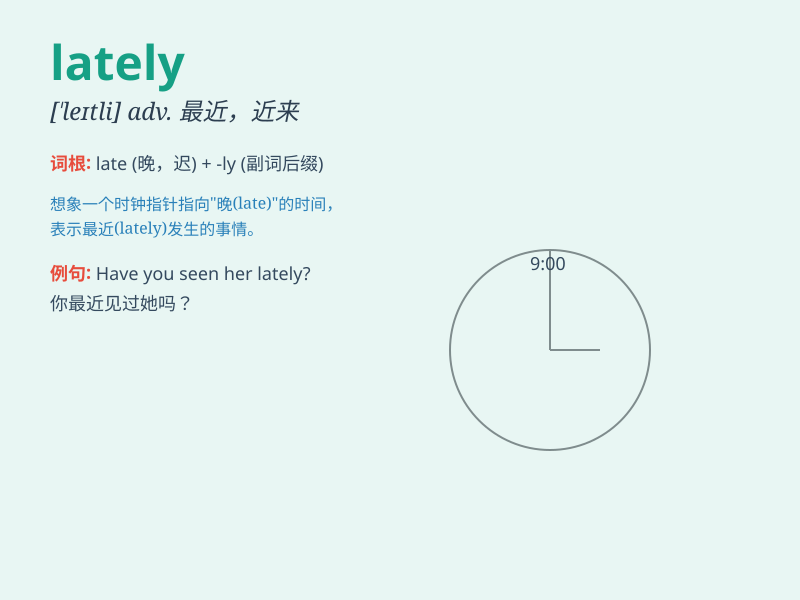

## lately

**英音:** _[\'leɪtlɪ]_ **美音:** _[\'letli]_

**译义:** *adv.近来,最近*

### 短语

+ **lately used:** _最近使用的_

+ **lately discovered:** _最近发现的_

+ **lately developed:** _最近开发的_

+ **lately arrived:** _最近到达的_

+ **lately published:** _最近出版的_

### 例句

#### 例句1

> **I haven\'t seen him lately.**

**中文翻译:** 我最近没见到他。

**单词释义:** 最近

#### 例句2

> **She has been very busy lately.**

**中文翻译:** 她最近很忙。

**单词释义:** 最近

#### 例句3

> **Have you been to the cinema lately?**

**中文翻译:** 你最近去过电影院吗？

**单词释义:** 最近

### 背诵小故事

> Lately, a little bird was lost. It searched everywhere but couldn\'t
find its way home. Finally, with the help of a kind girl, it returned
safely. \'Lately\' means recently or in the recent past.

**最近，一只小鸟迷路了。它到处寻找但都找不到回家的路。最后，在一个善良女孩的帮助下，它安全地回去了。'lately'意思是最近，近来。**

### 图义

