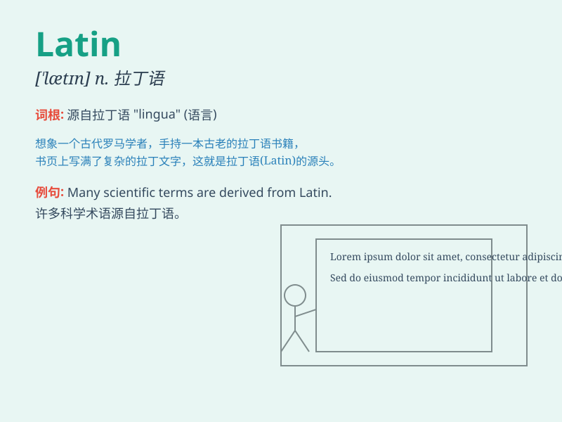

## Latin

**英音:** _[ˈlætɪn]_ **美音:** _[ˈlætn]_

**译义:** *n.拉丁语；拉丁人；拉丁音乐
adj.拉丁语的；拉丁人的；拉丁语系国家的*

### 短语

+ **Latin America:** _拉丁美洲_

+ **Latin Square:** _拉丁方_

+ **Latin alphabet:** _拉丁字母表_

+ **Latin grammar:** _拉丁语法_

+ **Latin dance:** _拉丁舞_

### 例句

#### 例句1

> **She studied Latin in high school.**

**中文翻译:** 她在高中学习了拉丁语。

**单词释义:** 拉丁语

#### 例句2

> **The doctor\'s prescription was written in Latin.**

**中文翻译:** 医生的处方是用拉丁语写的。

**单词释义:** 拉丁语

#### 例句3

> **Many legal terms originated from Latin.**

**中文翻译:** 许多法律术语源自拉丁语。

**单词释义:** 拉丁语

### 背诵小故事

>
从前有个勇敢的探险家，他在古老的图书馆中发现一本神秘的书籍，上面写满了
Latin 文字。他努力钻研，最终解开了书中隐藏的宝藏秘密。Latin
就像这神秘的文字，承载着古老的智慧和秘密。

**从前有个勇敢的探险家，他在古老的图书馆中发现一本满是拉丁语的神秘书籍。他努力钻研，最终解开了书中隐藏的宝藏秘密。拉丁语就像这神秘的文字，承载着古老的智慧和秘密。**

### 图义

