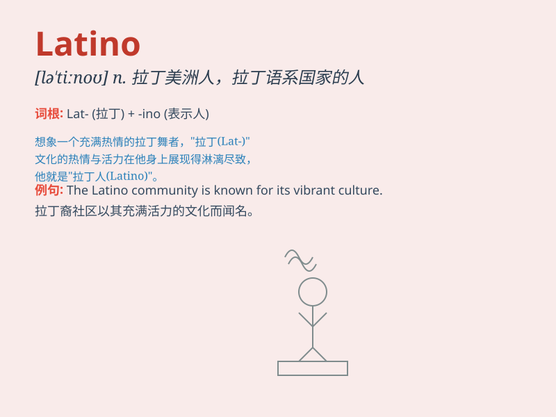

## Latino

**英音:** _[lætˈiːnəʊ]_ **美音:** _[lætˈiːnoʊ]_

**译义:**
*n.拉丁人，拉美人（Latina为女性形式）；adj.拉丁的，拉美的*

### 短语

+ **Latino community:** _拉丁裔社区_

+ **Latino culture:** _拉丁裔文化_

+ **Latino music:** _拉丁音乐_

+ **Latino population:** _拉丁裔人口_

+ **Latino heritage:** _拉丁裔遗产_

### 例句

#### 例句1

> **The Latino community in this city is very vibrant.**

**中文翻译:** 这个城市的拉丁裔社区非常有活力。

**单词释义:** 拉丁裔的

#### 例句2

> **She has a deep appreciation for Latino music and dance.**

**中文翻译:** 她对拉丁裔的音乐和舞蹈有着深深的欣赏。

**单词释义:** 拉丁裔的

#### 例句3

> **The Latino students are excelling in their studies.**

**中文翻译:** 拉丁裔的学生在学习上表现出色。

**单词释义:** 拉丁裔的

### 背诵小故事

> A Latino family moved to our neighborhood. They had colorful
celebrations and delicious food. Their music and dance made us all
happy. I learned a lot about their culture and now remember \'Latino\'
easily.

**一个拉丁裔家庭搬到了我们小区。他们有丰富多彩的庆祝活动和美味的食物。他们的音乐和舞蹈让我们都很开心。我了解了很多他们的文化，现在很容易就记住了\'Latino\'这个词。**

### 图义

