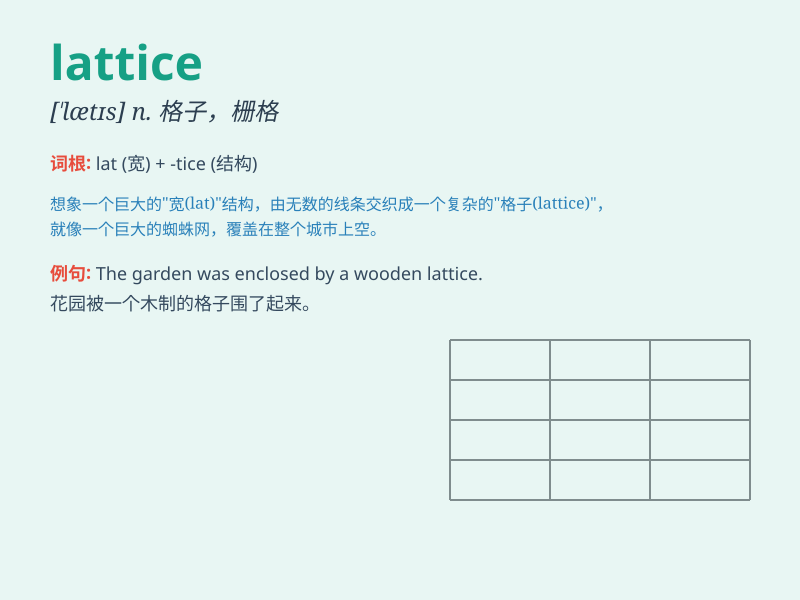

## lattice

**英音:** _[\'lætɪs]_ **美音:** _[\'lætɪs]_

**译义:** *n.格子*

### 短语

+ **lattice structure:** _晶格结构_

+ **lattice window:** _格子窗_

+ **lattice energy:** _晶格能_

+ **lattice point:** _格点_

+ **latticework fence:** _格子栅栏_

### 例句

#### 例句1

> **The lattice of the window was broken.**

**中文翻译:** 窗户的格子被打破了。

**单词释义:** 格子框架

#### 例句2

> **The scientist studied the lattice structure of the crystal.**

**中文翻译:** 这位科学家研究了晶体的晶格结构。

**单词释义:** 晶格

#### 例句3

> **The garden was surrounded by a lattice fence.**

**中文翻译:** 花园周围有格子栅栏。

**单词释义:** 格子栅栏

### 背诵小故事

> A little bird was trapped in a lattice. It struggled to get out but
the crisscross bars held it firmly. Finally, with the help of a kind
girl, the bird escaped. The lattice here is like a grid or framework.

**一只小鸟被困在一个格子结构里。它努力想出去，但纵横交错的栅栏把它牢牢困住。最后，在一个善良女孩的帮助下，小鸟逃脱了。这里的lattice就像一个网格或框架。**

### 图义

