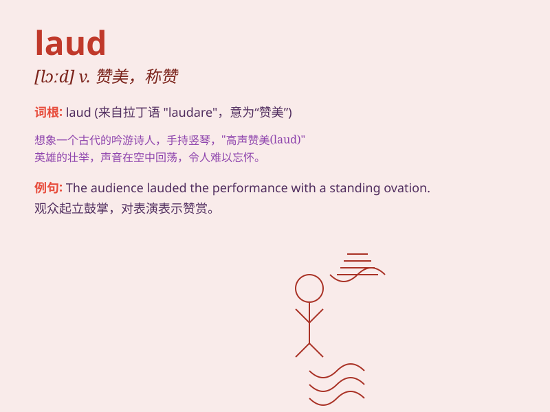

## laud

**英音:** _[lɔːd]_ **美音:** _[lɔd]_

**译义:** *n.赞美,称赞,颂歌vt.赞美,称赞*

### 短语

+ **laud to the skies:** _极力称赞；捧上天_

+ **laud sb. for sth.:** _因某事称赞某人_

+ **laud one\'s achievements:** _称赞某人的成就_

+ **laud the virtues of:** _称赞\...\...的优点_

+ **be loudly lauded:** _受到大声称赞_

### 例句

#### 例句1

> **The mayor was lauded for her efforts to improve public
transportation.**

**中文翻译:** 市长因改善公共交通所做的努力而受到赞扬。

**单词释义:** 称赞

#### 例句2

> **The athlete was lauded for his sportsmanship.**

**中文翻译:** 这位运动员因其体育精神而受到赞扬。

**单词释义:** 赞扬

#### 例句3

> **The scientist\'s achievements were highly lauded by the academic
community.**

**中文翻译:** 这位科学家的成就受到学术界的高度评价。

**单词释义:** 称赞

### 背诵小故事

> A king was very happy when his subjects loudly LAUDed his wise
decisions. The praise filled the palace and made the king feel proud.
Remember, \'laud\' means to praise highly.

**一位国王在他的臣民大声赞扬他明智的决定时非常高兴。赞美之声充满了宫殿，让国王感到自豪。记住，\'laud\'意思是高度赞扬。**

### 图义

