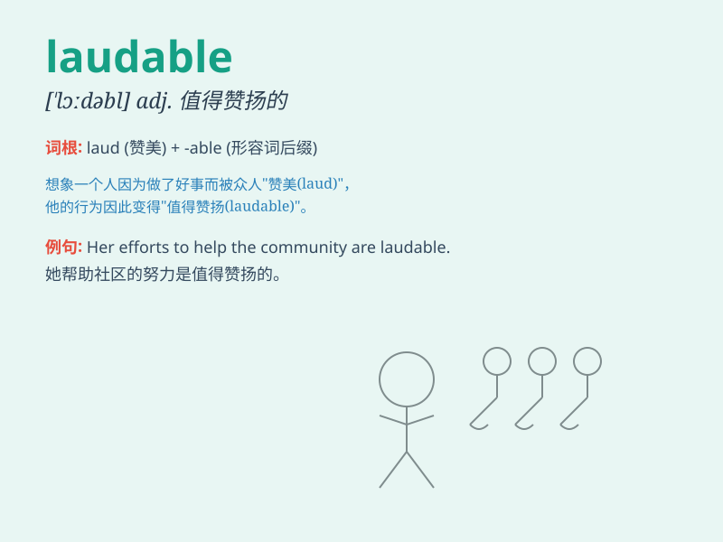

## laudable

**英音:** _[\'lɔːdəb(ə)l]_ **美音:** _[\'lɔdəbl]_

**译义:** *adj.值得赞美的,值得称赞的*

### 短语

+ **laudable effort:** _值得称赞的努力_

+ **laudable achievement:** _值得称赞的成就_

+ **laudable intention:** _值得称赞的意图_

+ **laudable goal:** _值得称赞的目标_

+ **laudable behavior:** _值得称赞的行为_

### 例句

#### 例句1

> **His efforts to help the poor are highly laudable.**

**中文翻译:** 他帮助穷人的努力值得高度赞扬。

**单词释义:** 值得称赞的

#### 例句2

> **The team\'s laudable performance in the tournament won them many
fans.**

**中文翻译:** 球队在比赛中的出色表现赢得了众多球迷的青睐。

**单词释义:** 出色的；值得赞扬的

#### 例句3

> **It is laudable that she has dedicated her life to charity
work.**

**中文翻译:** 值得称赞的是，她将一生奉献给了慈善事业。

**单词释义:** 值得称赞的

### 背诵小故事

> A young artist spent months creating a masterpiece. His hard work and
dedication were truly laudable. People praised him for his excellent
skills and the praiseworthy effort he put into his art.

**一位年轻的艺术家花了数月创作了一幅杰作。他的努力和奉献精神真的值得称赞。人们称赞他出色的技艺和他在艺术中投入的值得赞扬的努力。**

### 图义

