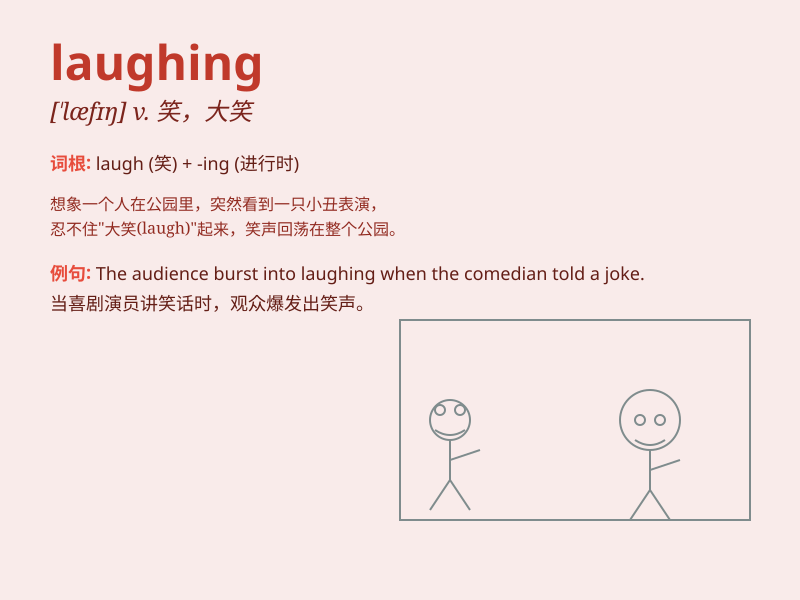

## laughing

**英音:** _[\'lɑːfɪŋ]_ **美音:** _[\'læfɪŋ]_

**译义:** *adj.带笑的,可笑的n.笑*

### 短语

+ **laughing gas:** _笑气（一氧化二氮）_

+ **laughing stock:** _笑柄；受人嘲笑者_

+ **laughing matter:** _可笑的事；轻松的事_

+ **burst out laughing:** _突然大笑_

+ **be laughing all the way to the bank:** _发大财；轻易赚大钱_

### 例句

#### 例句1

> **I saw him laughing happily in the park.**

**中文翻译:** 我看见他在公园里开心地笑。

**单词释义:** 大笑，发笑

#### 例句2

> **The children\'s laughing filled the classroom.**

**中文翻译:** 教室里充满了孩子们的笑声。

**单词释义:** 笑声

#### 例句3

> **She couldn\'t stop laughing at the funny joke.**

**中文翻译:** 听到这个有趣的笑话，她忍不住笑了起来。

**单词释义:** 大笑

### 背诵小故事

> One day, I saw a monkey in the zoo. It was making funny faces and
laughing loudly. Its laughing made all the visitors happy. The sound of
its laughing was so contagious that I couldn\'t help joining in the joy.

**有一天，我在动物园看到一只猴子。它正在做滑稽的鬼脸，大声笑着。它的笑声让所有游客都很开心。它的笑声极具感染力，我也忍不住跟着欢乐起来。**

### 图义

