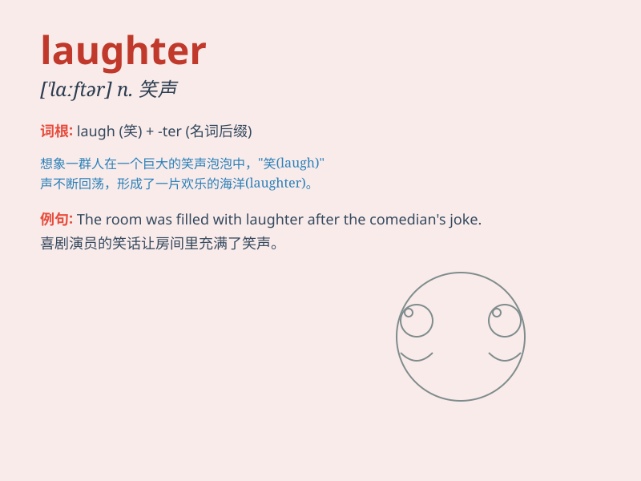

## laughter

**英音:** _[\'lɑːftə]_ **美音:** _[\'læftɚ]_

**译义:** *n.笑,笑声*

### 短语

+ **burst into laughter:** _突然大笑_

+ **roar with laughter:** _哄堂大笑_

+ **convulsed with laughter:** _笑得直不起腰_

+ **shriek with laughter:** _尖声大笑_

+ **peals of laughter:** _阵阵笑声_

### 例句

#### 例句1

> **The room filled with laughter when the comedian told the
joke.**

**中文翻译:** 当喜剧演员讲这个笑话时，房间里充满了笑声。

**单词释义:** 笑声

#### 例句2

> **Her laughter echoed through the hall.**

**中文翻译:** 她的笑声在大厅里回荡。

**单词释义:** 笑声

#### 例句3

> **We could hear the children\'s laughter from the playground.**

**中文翻译:** 我们可以听到操场上孩子们的笑声。

**单词释义:** 笑声

### 背诵小故事

> One day, I was feeling down. Then I went to a park and saw a group of
kids playing and their laughter was so contagious. It made me forget my
sadness and filled my heart with joy. Laughter truly has the power to
brighten our days.

**有一天，我心情低落。然后我去了公园，看到一群孩子在玩耍，他们的笑声极具感染力。这让我忘记了悲伤，心中充满了欢乐。笑声真的有照亮我们日子的力量。**

### 图义

