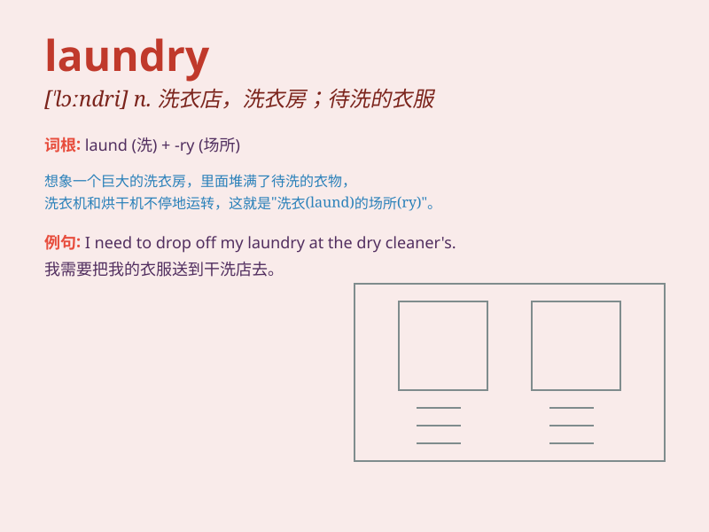

## laundry

**英音:** _[\'lɔːndrɪ]_ **美音:** _[\'lɔndri]_

**译义:** *n.洗衣店,要洗的衣服,洗熨*

### 短语

+ **laundry basket:** _洗衣篮_

+ **laundry detergent:** _洗衣粉；洗衣剂_

+ **laundry list:** _冗长的清单；细目清单_

+ **do the laundry:** _洗衣服_

+ **laundry room:** _洗衣房；洗衣间_

### 例句

#### 例句1

> **I need to do the laundry today.**

**中文翻译:** 我今天需要洗衣服。

**单词释义:** 要洗的衣服；洗衣物

#### 例句2

> **The laundry room is on the second floor.**

**中文翻译:** 洗衣房位于二楼。

**单词释义:** 洗衣房

#### 例句3

> **She took the dirty laundry to the cleaners.**

**中文翻译:** 她把脏衣服拿到洗衣店去。

**单词释义:** 要洗的衣服

### 背诵小故事

> One day, Tom was very tired after a long week. He had a pile of dirty
clothes, so he took them to the laundry. There, the machines washed and
dried his clothes, making them clean and fresh again.

**一天，汤姆在漫长的一周后非常疲惫。他有一堆脏衣服，所以他把它们带到洗衣房。在那里，机器清洗并烘干了他的衣服，让它们再次变得干净清新。**

### 图义

