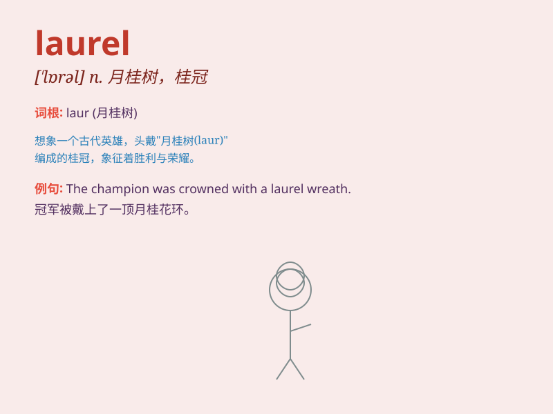

## laurel

**英音:** _[\'lɒr(ə)l]_ **美音:** _[\'lɔrəl]_

**译义:** *n.[植]月桂树,(pl.)桂冠,殊荣vt.使戴桂冠,授予荣誉*

### 短语

+ **laurel wreath:** _月桂叶花环_

+ **bear the laurel:** _获得殊荣_

+ **laurel tree:** _月桂树_

+ **rest on one\'s laurels:** _满足于既得荣誉；吃老本_

+ **look to one\'s laurels:** _小心保持自己的成就（或荣誉）_

### 例句

#### 例句1

> **She wore a laurel wreath on her head to symbolize victory.**

**中文翻译:** 她头上戴着象征胜利的月桂花环。

**单词释义:** 月桂树；月桂叶（象征胜利或荣誉）

#### 例句2

> **The poet was awarded the laurel of excellence for his outstanding
work.**

**中文翻译:** 这位诗人因其杰出的作品而被授予卓越桂冠。

**单词释义:** 荣誉；殊荣

#### 例句3

> **The laurel tree provided shade on the hot summer day.**

**中文翻译:** 月桂树在炎热的夏日提供了阴凉。

**单词释义:** 月桂树

### 背诵小故事

> A young athlete named Lily was determined to win the laurel in the
race. She trained hard every day. Finally, she crossed the finish line
first and was awarded the laurel wreath. It symbolized her victory and
hard work.

**一位名叫莉莉的年轻运动员决心在比赛中赢得桂冠。她每天刻苦训练。最终，她第一个冲过终点线，并被授予了月桂树花环。这象征着她的胜利和努力。**

### 图义

