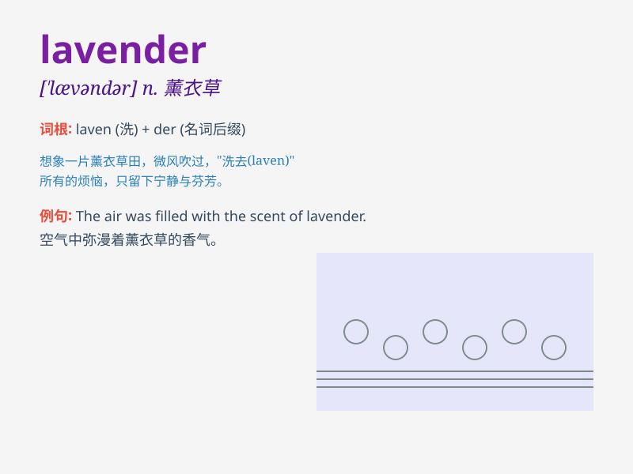

## lavender

**英音:** _[\'lævəndə]_ **美音:** _[\'lævəndɚ]_

**译义:**
*n.[植]熏衣草属,熏衣草花,淡紫色adj.淡紫色的vt.用熏衣草熏*

### 短语

+ **lavender oil:** _薰衣草油_

+ **lavender field:** _薰衣草田_

+ **lavender scent:** _薰衣草香味_

+ **dry lavender:** _干燥的薰衣草_

+ **lavender bush:** _薰衣草灌木丛_

### 例句

#### 例句1

> **The fields of lavender were a beautiful sight.**

**中文翻译:** 薰衣草田是一道美丽的风景。

**单词释义:** 薰衣草

#### 例句2

> **She wore a dress in lavender color.**

**中文翻译:** 她穿着一件淡紫色的连衣裙。

**单词释义:** 淡紫色

#### 例句3

> **The lavender scent filled the room.**

**中文翻译:** 房间里充满了薰衣草的香味。

**单词释义:** 薰衣草（植物）

### 背诵小故事

> A little girl was lost in a field full of lavender. The sweet smell
of lavender comforted her. Finally, she followed the lavender path and
found her way home. Lavender became her lucky charm.

**一个小女孩在满是薰衣草的田野里迷路了。薰衣草甜甜的味道安慰了她。最后，她沿着薰衣草的小路找到了回家的路。薰衣草成了她的幸运符。**

### 图义

