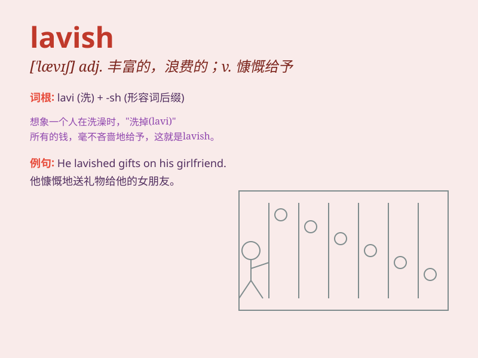

## lavish

**英音:** _[\'lævɪʃ]_ **美音:** _[\'lævɪʃ]_

**译义:** *adj.非常大方的,过分丰富的,浪费的vt.浪费,滥用,慷慨给予*

### 短语

+ **lavish praise:** _大量的赞扬_

+ **lavish party:** _奢华的聚会_

+ **lavish gift:** _慷慨的礼物_

+ **lavish lifestyle:** _奢侈的生活方式_

+ **lavish attention:** _过度的关注_

### 例句

#### 例句1

> **He was lavish in his praise of her cooking.**

**中文翻译:** 他对她的厨艺赞不绝口。

**单词释义:** 慷慨地，大量地

#### 例句2

> **The millionaire was lavish with his money.**

**中文翻译:** 这位百万富翁挥霍无度。

**单词释义:** 浪费，挥霍

#### 例句3

> **They gave a lavish party for their daughter\'s wedding.**

**中文翻译:** 他们为女儿的婚礼举办了一场盛大的派对。

**单词释义:** 奢华的，豪华的

### 背诵小故事

> A king was very lavish. He spent money freely to build huge palaces
and throw grand parties. But his people were poor. One day, a wise man
told him to be more careful with his wealth. The king finally understood
and changed.

**一位国王非常奢华。他随意花钱建造巨大的宫殿，举办盛大的派对。但他的子民却很贫穷。一天，一位智者告诉他要更谨慎地对待财富。国王最终明白了并做出了改变。**

### 图义

