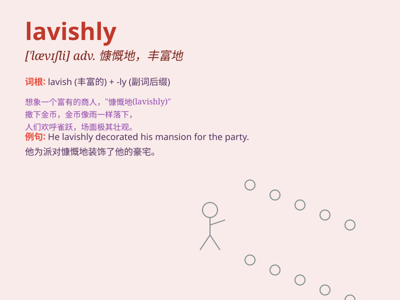

## lavishly

**英音:** _[\'lævɪʃli]_ **美音:** _[\'lævɪʃli]_

**译义:** *adv.浪费地,丰富地*

### 短语

+ **lavishly decorated:** _装饰豪华_

+ **lavishly funded:** _资金充裕_

+ **lavishly praised:** _大肆称赞_

+ **lavishly entertained:** _盛情款待_

+ **lavishly furnished:** _布置奢华_

### 例句

#### 例句1

> **The wedding was lavishly decorated.**

**中文翻译:** 婚礼布置得很豪华。

**单词释义:** 奢华地

#### 例句2

> **He spent money lavishly on his hobbies.**

**中文翻译:** 他在自己的爱好上花钱很多。

**单词释义:** 大量地；毫不吝惜地

#### 例句3

> **The host entertained the guests lavishly.**

**中文翻译:** 主人盛情款待客人。

**单词释义:** 慷慨地；丰盛地

### 背诵小故事

> A rich prince spent money lavishly. He threw grand parties, bought
countless jewels, and never cared about the cost. His lavish spending
made everyone amazed.

**一位富有的王子花钱大手大脚。他举办盛大的派对，购买无数珠宝，从不在乎花费。他的挥霍无度让每个人都感到惊讶。**

### 图义

