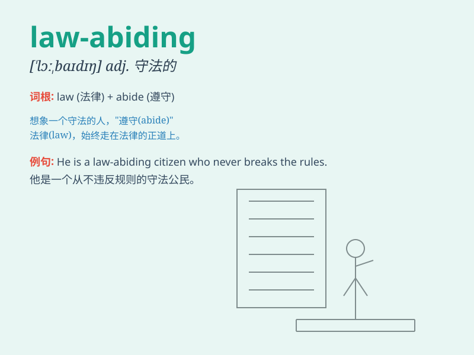

## law-abiding

**英音:** _[lɔː ˈbaɪdɪŋ]_ **美音:** _[lɔː ˈbaɪdɪŋ]_

**译义:** *adj. 守法的；遵守法律的*

### 短语

+ **law-abiding citizen:** _守法公民_

+ **law-abiding behavior:** _守法行为_

+ **remain law-abiding:** _保持守法_

+ **encourage law-abiding:** _鼓励守法_

+ **a law-abiding society:** _一个守法的社会_

### 例句

#### 例句1

> **He is a law-abiding citizen and has never broken the law.**

**中文翻译:** 他是一个守法的公民，从未违法。

**单词释义:** 守法的

#### 例句2

> **The law-abiding people in this community enjoy a peaceful
life.**

**中文翻译:** 这个社区里守法的人们享受着平静的生活。

**单词释义:** 守法的

#### 例句3

> **We should encourage more people to become law-abiding.**

**中文翻译:** 我们应该鼓励更多的人成为守法的人。

**单词释义:** 守法的

### 背诵小故事

> One day, a thief decided to change and become law-abiding. He stopped
stealing and started following the law. People were happy and trusted
him again. Remember, law-abiding means following the law and being good
citizens.

**有一天，一个小偷决定改变，变得守法。他不再偷窃，开始遵守法律。人们很高兴并且再次信任他。记住，law-abiding
意思是遵守法律，做良好公民。**

### 图义

