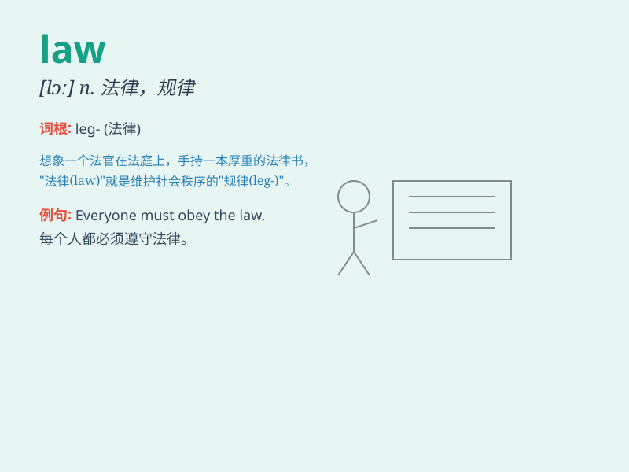

## law

**英音:** _[lɔː]_ **美音:** _[lɔ]_

**译义:** *n.法律；规律；法治；法学；诉讼；司法界 vi.起诉；控告
vt.对...起诉；控告*

### 短语

+ **break the law:** _违法；犯法_

+ **obey the law:** _遵守法律_

+ **pass a law:** _通过一项法律_

+ **law enforcement:** _执法；法律的实施_

+ **criminal law:** _刑法_

### 例句

#### 例句1

> **The law should be fair and just.**

**中文翻译:** 法律应当公平公正。

**单词释义:** 法律

#### 例句2

> **He studies law at university.**

**中文翻译:** 他在大学里学习法律。

**单词释义:** 法律（学科）

#### 例句3

> **We must obey the law.**

**中文翻译:** 我们必须遵守法律。

**单词释义:** 法律

### 背诵小故事

> A brave lawyer was fighting for justice in the courtroom. He used his
knowledge of the law to defend the innocent. The law is like a shield,
protecting people\'s rights and keeping society in order.

**一位勇敢的律师在法庭上为正义而战。他运用自己的法律知识为无辜者辩护。法律就像一面盾牌，保护着人们的权利，维持着社会的秩序。**

### 图义

