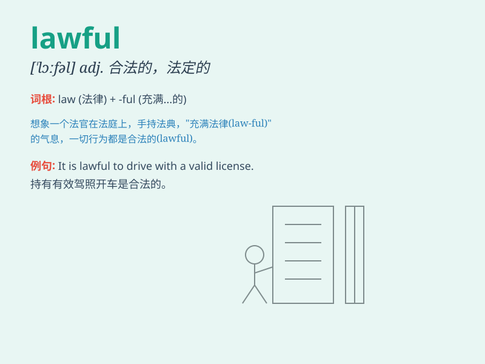

## lawful

**英音:** _[\'lɔːfʊl; -f(ə)l]_ **美音:** _[\'lɔfl]_

**译义:** *adj.法律许可的,守法的,受自然规律支配的*

### 短语

+ **lawful act:** _合法行为_

+ **lawful authority:** _合法权威_

+ **lawful business:** _合法业务_

+ **lawful excuse:** _合法借口_

+ **lawful heir:** _合法继承人_

### 例句

#### 例句1

> **It is lawful to park here after 6 p.m.**

**中文翻译:** 下午 6 点后在此停车是合法的。

**单词释义:** 合法的

#### 例句2

> **Only lawful activities are protected by law.**

**中文翻译:** 只有合法的活动才受到法律的保护。

**单词释义:** 合法的

#### 例句3

> **The police have the power to take lawful actions.**

**中文翻译:** 警方有权采取合法行动。

**单词释义:** 合法的

### 背诵小故事

> A thief was caught by the police. But he claimed that his actions
were lawful because he thought he was just taking back what was owed to
him. Of course, the law proved him wrong. Lawful means conforming to the
law.

**一个小偷被警察抓住了。但他声称他的行为是合法的，因为他认为他只是拿回属于他的东西。当然，法律证明他错了。Lawful
意思是合法的、守法的。**

### 图义

