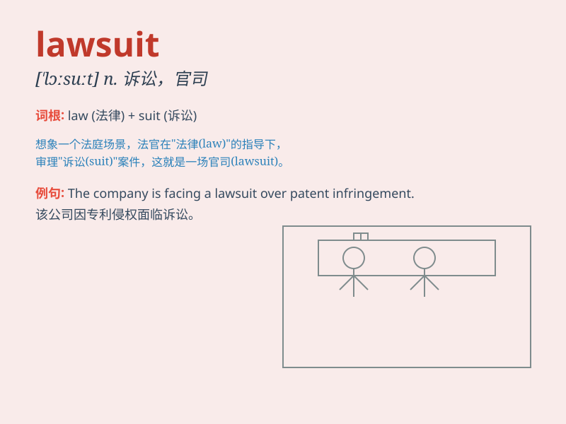

## lawsuit

**英音:** _[\'lɔːsuːt; -sjuːt]_ **美音:** _[\'lɔsut]_

**译义:** *n.诉讼(尤指非刑事案件)*

### 短语

+ **file a lawsuit:** _提起诉讼_

+ **win a lawsuit:** _赢得诉讼_

+ **lose a lawsuit:** _输掉诉讼_

+ **settle a lawsuit:** _解决诉讼_

+ **involved in a lawsuit:** _卷入诉讼_

### 例句

#### 例句1

> **The company is facing a major lawsuit over patent
infringement.**

**中文翻译:** 该公司正面临一场有关专利侵权的重大诉讼。

**单词释义:** 诉讼

#### 例句2

> **He decided to file a lawsuit against his employer for wrongful
dismissal.**

**中文翻译:** 他决定对雇主提起不当解雇诉讼。

**单词释义:** 诉讼

#### 例句3

> **The lawsuit has been dragging on for months, causing a lot of
stress for both parties.**

**中文翻译:** 该诉讼已拖了几个月，给双方都带来了很大的压力。

**单词释义:** 诉讼

### 背诵小故事

> A poor man was wrongly accused and faced a lawsuit. He was very
worried but found a smart lawyer to help. Finally, justice was served
and he won the lawsuit.

**一个可怜的人被错误地指控并面临诉讼。他非常担心，但找到了一位聪明的律师帮忙。最终，正义得到伸张，他赢得了诉讼。**

### 图义

