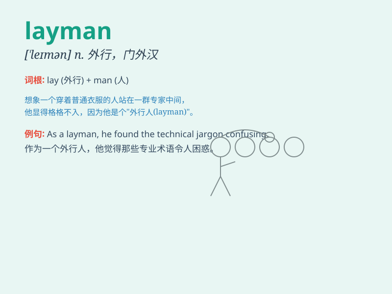

## layman

**英音:** _[\'leɪmən]_ **美音:** _[\'lemən]_

**译义:** *n.外行*

### 短语

+ **layman\'s terms:** _通俗易懂的语言_

+ **an utter layman:** _一个十足的门外汉_

+ **a layman\'s view:** _外行的看法_

+ **be no layman:** _不是外行_

+ **beyond the layman:** _超出外行的理解范围_

### 例句

#### 例句1

> **The legal issue was too complex for the layman to understand.**

**中文翻译:** 法律问题对于外行来说太复杂了，难以理解。

**单词释义:** 外行人；门外汉

#### 例句2

> **In this technical field, even laymen can appreciate the
significance of the discovery.**

**中文翻译:** 在这个技术领域，即使是外行人也能体会到这一发现的意义。

**单词释义:** 外行；非专业人员

#### 例句3

> **The instructions were written in simple language so that laymen
could follow them easily.**

**中文翻译:** 这些说明以简单的语言编写，以便外行可以轻松遵循。

**单词释义:** 外行；非专业人士

### 背诵小故事

> 想象一下，有个叫 Tom 的人，他不懂复杂的医学知识，被称为
layman。有次朋友生病，Tom
只能干着急，因为他这个门外汉不知道如何帮忙。所以 layman
就是指外行、门外汉。

**想象一下，有个叫汤姆的人，他不懂复杂的医学知识，被称为外行。有次朋友生病，汤姆只能干着急，因为他这个门外汉不知道如何帮忙。所以
layman 就是指外行、门外汉。**

### 图义

