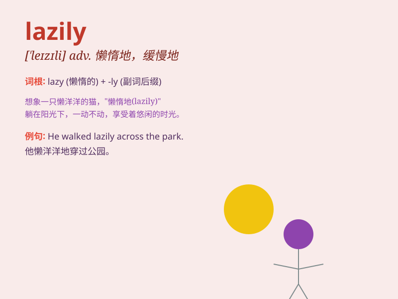

## lazily

**英音:** _[\'leɪzɪlɪ]_ **美音:** _[\'leɪzɪlɪ]_

**译义:** *adv.懒洋洋地*

### 短语

+ **lazily lie:** _懒洋洋地躺着_

+ **lazily sleep:** _慵懒地睡觉_

+ **lazily walk:** _懒洋洋地走_

+ **lazily reply:** _懒洋洋地回答_

+ **lazily stretch:** _懒洋洋地伸展_

### 例句

#### 例句1

> **He sat lazily in the chair, not willing to move.**

**中文翻译:** 他懒洋洋地坐在椅子上，一动也不肯动。

**单词释义:** 懒惰地，懒散地

#### 例句2

> **She answered the question lazily, showing no enthusiasm.**

**中文翻译:** 她懒洋洋地回答了问题，没有表现出任何热情。

**单词释义:** 无精打采地，漫不经心地

#### 例句3

> **The cat stretched lazily in the sun.**

**中文翻译:** 猫在阳光下懒洋洋地伸着懒腰。

**单词释义:** 慵懒地

### 背诵小故事

> One sunny day, a sloth was moving lazily in the tree. It took ages to
reach a branch. Everyone else was busy, but the sloth just did things
lazily. It shows how \'lazily\' means doing something slowly and without
much effort.

**在一个阳光明媚的日子里，一只树懒在树上懒洋洋地移动。它花了很长时间才到达一个树枝。其他人都很忙，但树懒只是懒洋洋地做事。这表明"lazily"意味着做事缓慢且不怎么费力。**

### 图义

