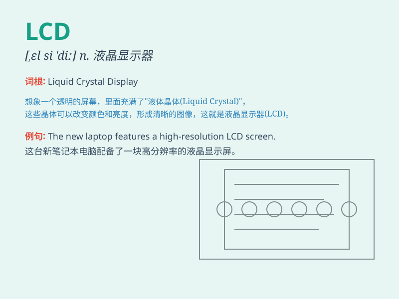

## LCD

**英音:** _[ˌɛlˈsiːˈdiː]_ **美音:** _[ˌɛlˈsiːˈdiː]_

**译义:** *LCD是液晶显示器（Liquid Crystal
Display）的缩写，常用于电子设备如电视、电脑屏幕等显示技术*

### 短语

+ **LCD display:** _液晶显示屏_

+ **LCD monitor:** _液晶显示器_

+ **LCD panel:** _液晶面板_

+ **LCD projector:** _液晶投影仪_

+ **LCD television:** _液晶电视_

### 例句

#### 例句1

> **The new laptop has an LCD screen with high resolution.**

**中文翻译:** 这台新笔记本电脑有一个高分辨率的液晶显示屏。

**单词释义:** 液晶显示屏

#### 例句2

> **The LCD monitor on my desk provides a clear image.**

**中文翻译:** 我桌上的液晶显示器提供了清晰的图像。

**单词释义:** 液晶显示器

#### 例句3

> **We need to replace the damaged LCD of the TV.**

**中文翻译:** 我们需要更换这台电视损坏的液晶显示屏。

**单词释义:** 液晶显示屏

### 背诵小故事

>
想象一下，在一个黑暗的房间里，有一台神奇的设备，它的屏幕清晰明亮，显示着各种信息。这个屏幕就是
LCD ，它就像一个小精灵，用液体和晶体的魔法为我们带来精彩的画面。

**想象在黑暗房间中，有台设备的清晰明亮屏幕即 LCD
，像有魔法的小精灵用液体和晶体带来精彩画面。**

### 图义

