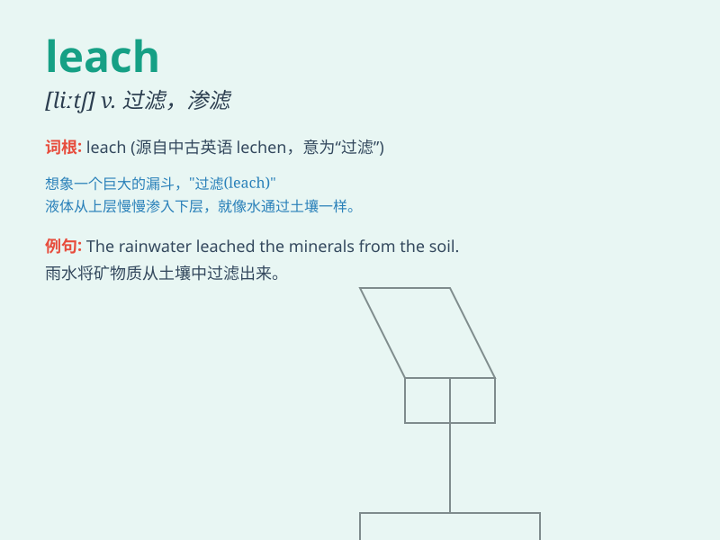

## leach

**英音:** _[liːtʃ]_ **美音:** _[litʃ]_

**译义:** *v.滤去*

### 短语

+ **leach field:** _沥滤场；渗滤场_

+ **leach out:** _滤去；溶出_

+ **leach liquor:** _沥滤液；浸出液_

+ **leach solution:** _浸出液；沥滤液_

+ **leach through:** _渗透；滤过_

### 例句

#### 例句1

> **The heavy rain might leach nutrients from the soil.**

**中文翻译:** 大雨可能会流失土壤中的养分。

**单词释义:** 滤去，滤掉

#### 例句2

> **Chemicals leach out of the container and into the
environment.**

**中文翻译:** 化学品从容器中渗出并进入环境。

**单词释义:** 渗出，浸出

#### 例句3

> **The poison leached into the groundwater.**

**中文翻译:** 毒物渗入地下水。

**单词释义:** 渗入，渗透

### 背诵小故事

> 想象一下，在一个古老的实验室里，有一种神奇的液体 leach
正在慢慢渗出容器，它就像一个神秘的精灵，悄悄地溜走。这个液体不断地过滤、渗透，仿佛在寻找新的出路。

**想象在古老实验室中，【leach】（渗出、过滤、渗透）这种神奇液体慢慢从容器中溜走，不断过滤和渗透，像在找新出路。**

### 图义

