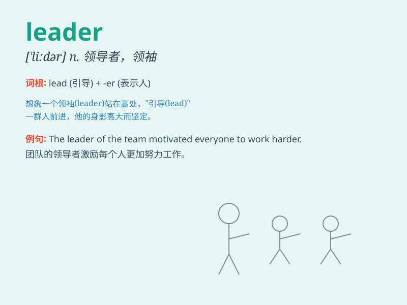

## leader

**英音:** _[\'liːdə]_ **美音:** _[\'lidɚ]_

**译义:** *n.领导者,社论n.[计]前导字符n.[机]导杆*

### 短语

+ **team leader:** _团队领导_

+ **group leader:** _小组组长_

+ **project leader:** _项目负责人_

+ **community leader:** _社区领袖_

+ **political leader:** _政治领袖_

### 例句

#### 例句1

> **The leader of the team is very experienced.**

**中文翻译:** 团队的领导者非常有经验。

**单词释义:** 领导者

#### 例句2

> **He emerged as a natural leader during the crisis.**

**中文翻译:** 在危机期间，他成为了天生的领导者。

**单词释义:** 领袖

#### 例句3

> **The political leader delivered a passionate speech.**

**中文翻译:** 政治领导人发表了热情洋溢的讲话。

**单词释义:** 领导人

### 背诵小故事

> A brave mouse was chosen as the leader of the animal group. It led
them to find food and stay safe. The mouse\'s courage and wisdom made it
a great leader.

**一只勇敢的老鼠被选为动物群体的领导者。它带领它们寻找食物并保证安全。这只老鼠的勇气和智慧使它成为了一个出色的领导者。**

### 图义

