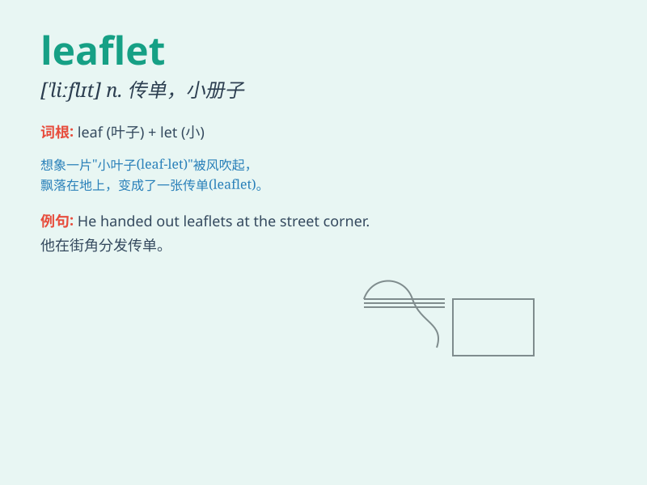

## leaflet

**英音:** _[ˈliːflət]_ **美音:** _[\'liflət]_

**译义:** *n.小叶,传单*

### 短语

+ **distribute leaflets:** _散发传单_

+ **advertising leaflet:** _广告传单_

+ **informational leaflet:** _信息传单_

+ **promotional leaflet:** _促销传单_

+ **leaflet campaign:** _传单宣传活动_

### 例句

#### 例句1

> **The company distributed leaflets to promote their new
product.**

**中文翻译:** 这家公司分发传单来推广他们的新产品。

**单词释义:** 传单

#### 例句2

> **She picked up a leaflet about local attractions.**

**中文翻译:** 她拿起了一张关于当地景点的传单。

**单词释义:** 传单

#### 例句3

> **The tourist office provides various leaflets for visitors.**

**中文翻译:** 游客办公室为游客提供各种各样的传单。

**单词释义:** 传单

### 背诵小故事

> A little ant was lost in a forest. Suddenly, it saw a leaflet flying
by. The leaflet had a map on it and helped the ant find its way home.
The ant was so happy!

**一只小蚂蚁在森林里迷路了。突然，它看到一张传单飞过。传单上有一张地图，帮助蚂蚁找到了回家的路。蚂蚁非常高兴！**

### 图义

