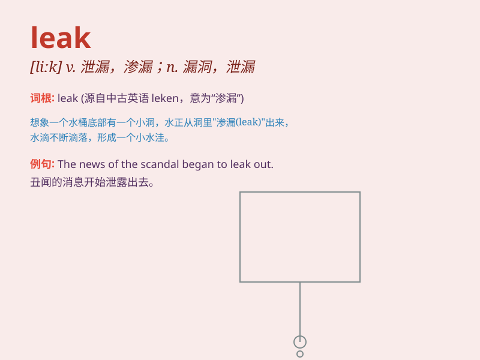

## leak

**英音:** _[liːk]_ **美音:** _[lik]_

**译义:** *n.漏洞,漏出,漏出物,泄漏,\<俚>撒尿vi.漏,泄漏vt.使渗漏*

### 短语

+ **leak out:** _泄漏；走漏；透露_

+ **gas leak:** _煤气泄漏_

+ **oil leak:** _石油泄漏_

+ **leak information:** _泄露信息_

+ **leak proof:** _防漏的_

### 例句

#### 例句1

> **The pipe is leaking water.**

**中文翻译:** 水管漏水。

**单词释义:** 泄漏；渗漏

#### 例句2

> **News of the deal leaked out before it was officially
announced.**

**中文翻译:** 该交易的消息在正式宣布之前就已泄露。

**单词释义:** 泄露；走漏

#### 例句3

> **The roof was leaking during the rainstorm.**

**中文翻译:** 暴雨期间屋顶漏水。

**单词释义:** 漏；渗

### 背诵小故事

> A pipe in the old house started to leak. Water was dripping
everywhere. The owner quickly called a plumber to fix the leak and stop
the waste of water.

**在那所老房子里，一根水管开始漏水。水到处滴。房主赶紧叫水管工来修补漏洞，阻止水的浪费。**

### 图义

