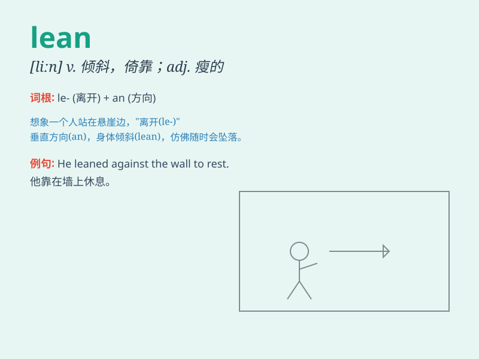

## lean

**英音:** _[liːn]_ **美音:** _[lin]_

**译义:**
*n.倾斜,倾斜度,倚靠,倾向adj.瘦的,贫乏的,歉收的vi.倚靠,倾斜,依赖,倾向,偏向vt.使倾斜*

### 短语

+ **lean against:** _靠在\...\...上_

+ **lean on:** _依靠；依赖_

+ **lean forward:** _向前倾_

+ **lean back:** _向后靠_

+ **lean towards:** _倾向于；偏向_

### 例句

#### 例句1

> **He leaned against the wall, looking tired.**

**中文翻译:** 他靠在墙上，看上去很疲惫。

**单词释义:** 倚靠

#### 例句2

> **The company is trying to lean its operation to be more
efficient.**

**中文翻译:** 该公司正在努力精简其运营以提高效率。

**单词释义:** 使倾斜；精简

#### 例句3

> **She has a lean figure.**

**中文翻译:** 她有着苗条的身材。

**单词释义:** 瘦的；无脂肪的

### 背诵小故事

> A young athlete always leans against the wall after a long run to
catch his breath. He leans there because he is too tired. One day, he
realizes that leaning too much makes him lazy, so he decides to stand
strong.

**一位年轻的运动员在长跑后总是靠墙倾斜着身子喘气。他靠在那里是因为太累了。有一天，他意识到过度倾斜让自己变得懒惰，所以决定坚强站直。**

### 图义

