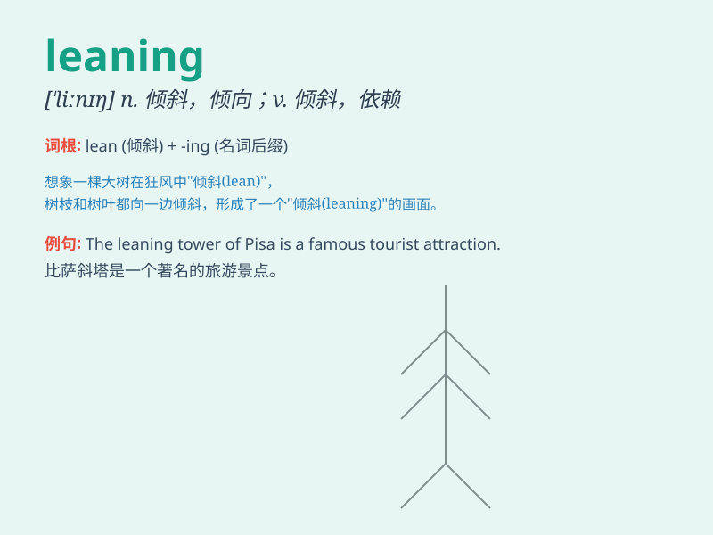

## leaning

**英音:** _[\'liːnɪŋ]_ **美音:** _[\'linɪŋ]_

**译义:** *n.倾斜,倾向,爱好v.清洁,清洗*

### 短语

+ **have a leaning towards:** _倾向于；偏爱_

+ **intellectual leaning:** _知识倾向；学术倾向_

+ **political leaning:** _政治倾向_

+ **artistic leaning:** _艺术倾向；艺术爱好_

+ **philosophical leaning:** _哲学倾向；哲学爱好_

### 例句

#### 例句1

> **She has a leaning towards classical music.**

**中文翻译:** 她对古典音乐有偏爱。

**单词释义:** 倾向；爱好

#### 例句2

> **His political leanings are well-known.**

**中文翻译:** 他的政治倾向是众所周知的。

**单词释义:** 倾向；偏向

#### 例句3

> **The tower has a slight leaning to the left.**

**中文翻译:** 塔身稍微向左倾斜。

**单词释义:** 倾斜

### 背诵小故事

> A young boy was always leaning against the wall when waiting for his
friends. One day, he realized that leaning too much made him look lazy.
So, he decided to stand straight. \'Leaning\' means to rest against
something at an angle.

**一个小男孩在等朋友时总是倚靠着墙。有一天，他意识到过度倚靠让他看起来很懒。于是，他决定站直。\'leaning\'意思是倾斜着靠在某物上。**

### 图义

