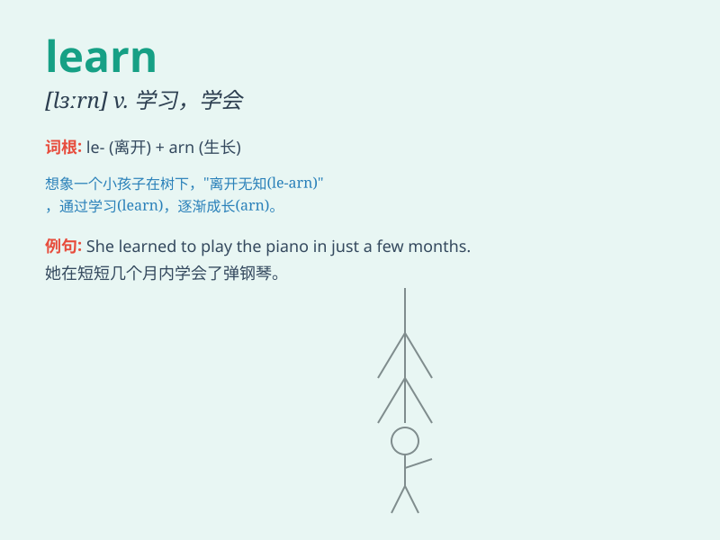

## learn

**英音:** _[lɜːn]_ **美音:** _[lɝn]_

**译义:** *vi.学习,听到,获悉vt.学习,学会,认识到*

### 短语

+ **learn from:** _向\...学习；从\...吸取教训_

+ **learn about:** _了解；学习关于\..._

+ **learn by heart:** _记住；背诵_

+ **learn to do sth:** _学会做某事_

+ **learn one\'s lesson:** _吸取教训_

### 例句

#### 例句1

> **I want to learn English.**

**中文翻译:** 我想学英语。

**单词释义:** 学习

#### 例句2

> **She learned to play the piano when she was five.**

**中文翻译:** 她五岁时就学会了弹钢琴。

**单词释义:** 学会

#### 例句3

> **We should learn from our mistakes.**

**中文翻译:** 我们应该从错误中吸取教训。

**单词释义:** 吸取（教训）

### 背诵小故事

> One day, a little monkey saw a bird singing beautifully. The monkey
wanted to learn how to sing like the bird. So it listened carefully and
practiced every day. Finally, it could sing well too. Learn means to
acquire knowledge or skills by studying or practicing.

**有一天，一只小猴子看到一只鸟唱歌很好听。猴子想要学习像鸟一样唱歌。于是它认真倾听并且每天练习。最后，它也能唱得很好。Learn
意思是通过学习或练习获得知识或技能。**

### 图义

