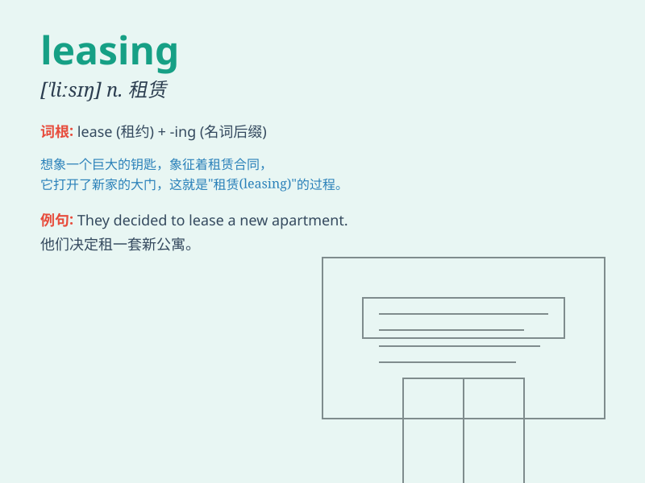

## leasing

**英音:** _[\'liːsɪŋ]_ **美音:** _[\'lizɪŋ]_

**译义:** *n.\<古>\<苏格兰>说谎,谎言*

### 短语

+ **leasing company:** _租赁公司_

+ **leasing agreement:** _租赁协议_

+ **leasing contract:** _租赁合同_

+ **leasing business:** _租赁业务_

+ **leasing service:** _租赁服务_

### 例句

#### 例句1

> **The company is involved in leasing office space.**

**中文翻译:** 该公司从事办公空间租赁业务。

**单词释义:** 租赁（动词）

#### 例句2

> **Leasing a car can be a more flexible option than buying one.**

**中文翻译:** 租赁汽车可能是比购买汽车更灵活的选择。

**单词释义:** 租赁（动名词）

#### 例句3

> **The leasing agreement is valid for two years.**

**中文翻译:** 租赁协议有效期为两年。

**单词释义:** 租赁（名词）

### 背诵小故事

>
想象一下，有个年轻人想创业，但是没钱买设备。这时，一家公司出现，说可以把设备租给他使用，这种出租的行为就是leasing。年轻人通过leasing获得了成功。

**想象一个年轻人因没钱买设备，一家公司将设备出租给他的行为就是leasing，年轻人借此成功。**

### 图义

