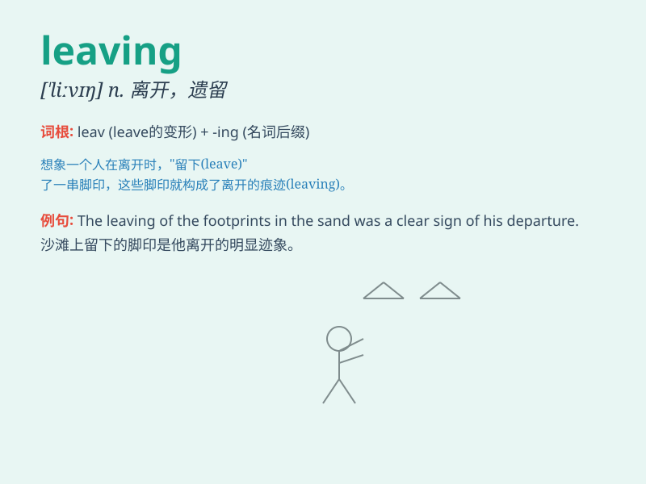

## leaving

**英音:** _[\'liːvɪŋ]_ **美音:** _[\'livɪŋ]_

**译义:** *n.离开*

### 短语

+ **leaving certificate:** _（英国）中学毕业考试证书_

+ **leaving party:** _告别聚会_

+ **leaving present:** _临别礼物_

+ **leaving date:** _离开日期_

+ **leaving time:** _离开时间_

### 例句

#### 例句1

> **I\'m leaving for Paris tomorrow.**

**中文翻译:** 我明天要去巴黎。

**单词释义:** 离开（某地）前往（另一地）

#### 例句2

> **She is leaving the company after five years of service.**

**中文翻译:** 她在公司工作五年后即将离开公司。

**单词释义:** 离开（工作单位、组织等）

#### 例句3

> **The train is leaving the station.**

**中文翻译:** 火车即将离开车站。

**单词释义:** 离开（某个地点）

### 背诵小故事

> A little bird was leaving its nest for the first time. It spread its
wings and flew away bravely, ready to explore the big world. Leaving
means to go away from a place.

**一只小鸟第一次离开它的巢。它展开翅膀勇敢地飞走了，准备去探索这个大世界。Leaving
意思是从一个地方走开。**

### 图义

