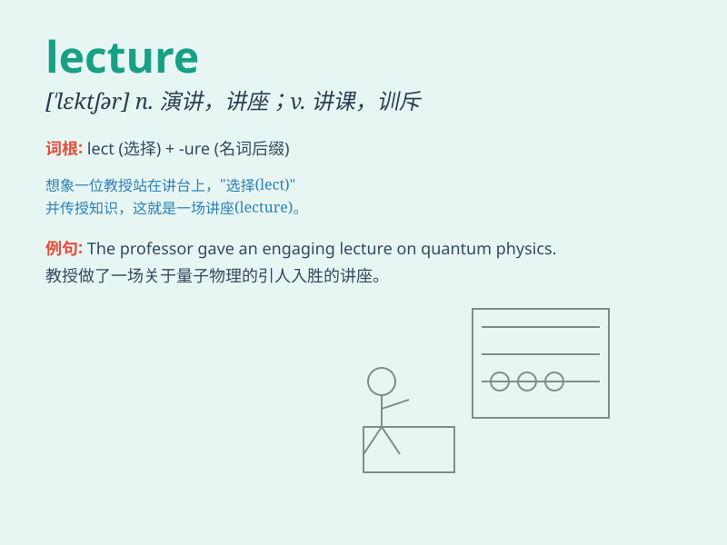

## lecture

**英音:** _[\'lektʃə]_ **美音:** _[\'lɛktʃɚ]_

**译义:** *n.演讲,讲稿,谴责,教训vt.演讲,训诫,说教vi.讲演*

### 短语

+ **give a lecture:** _做演讲；讲课_

+ **attend a lecture:** _参加讲座_

+ **public lecture:** _公开讲座_

+ **lecture hall:** _演讲厅；讲堂_

+ **lecture series:** _系列讲座_

### 例句

#### 例句1

> **The professor gave a fascinating lecture on quantum physics.**

**中文翻译:** 这位教授做了关于量子物理学的精彩讲座。

**单词释义:** 讲座；演讲

#### 例句2

> **He always falls asleep during lectures.**

**中文翻译:** 他总是在听课时睡着。

**单词释义:** 讲座

#### 例句3

> **My mother lectures me about my grades.**

**中文翻译:** 我妈妈对我的成绩进行了教训。

**单词释义:** 训斥；告诫

### 背诵小故事

>
一位老师在讲台上激情地进行演讲（lecture），台下的学生们聚精会神地听着。老师通过生动的例子和有趣的互动，让知识像清泉一样流淌进学生们的脑海。

**一位老师在讲台上激情地进行演讲，台下的学生们聚精会神地听着。老师通过生动的例子和有趣的互动，让知识像清泉一样流淌进学生们的脑海。**

### 图义

