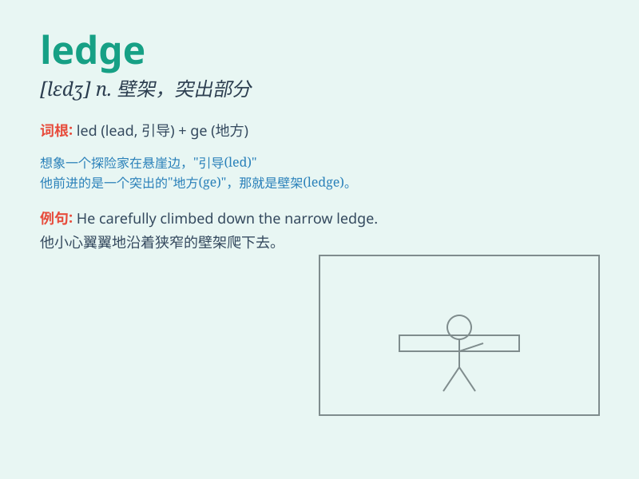

## ledge

**英音:** _[ledʒ]_ **美音:** _[lɛdʒ]_

**译义:** *n.壁架,架状突出物,暗礁,矿层*

### 短语

+ **window ledge:** _窗台_

+ **rock ledge:** _岩石突出部分；岩架_

+ **shelf ledge:** _架子边缘；搁板边缘_

+ **ledge stone:** _基石；窗台石_

+ **cliff ledge:** _悬崖壁架；悬崖突出部分_

### 例句

#### 例句1

> **He was standing on a narrow ledge high above the ground.**

**中文翻译:** 他站在高出地面的狭窄壁架上。

**单词释义:** 壁架；突出的狭长平台

#### 例句2

> **The climber managed to reach the ledge and take a rest.**

**中文翻译:** 登山者设法到达壁架并休息。

**单词释义:** 壁架；岩架

#### 例句3

> **There was a ledge outside the window where she could place her
plants.**

**中文翻译:** 窗外有一个壁架，她可以在那里放置植物。

**单词释义:** 窗台；（突出的）狭长搁板

### 背诵小故事

> A brave climber was stuck on a ledge during a storm. He held on
tightly, praying for rescue. The ledge was narrow but saved his life.
Finally, he was saved. Remember, a ledge can be a lifesaver!

**一位勇敢的登山者在暴风雨中被困在一个壁架上。他紧紧抓住，祈祷能获救。这个壁架很窄，但救了他的命。最后，他得救了。记住，壁架（ledge）可能是救命的！**

### 图义

