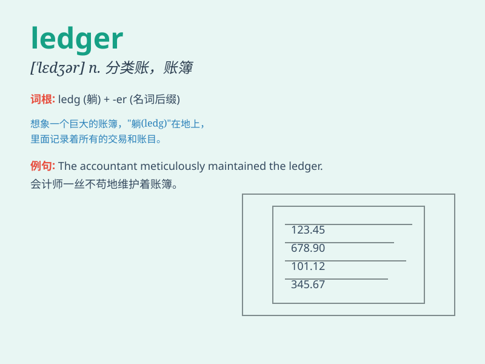

## ledger

**英音:** _[\'ledʒə]_ **美音:** _[\'lɛdʒɚ]_

**译义:** *n.[会计]分类帐,分户总帐,底帐,[建](手脚架上的)横木*

### 短语

+ **general ledger:** _总分类账_

+ **ledger account:** _分类账账户_

+ **ledger balance:** _分类账余额_

+ **sales ledger:** _销售分类账_

+ **purchase ledger:** _购货分类账_

### 例句

#### 例句1

> **The accountant updated the ledger with the latest financial
transactions.**

**中文翻译:** 会计师用最新的金融交易更新了分类账。

**单词释义:** 分类账

#### 例句2

> **He referred to the ledger to check the balance of the
account.**

**中文翻译:** 他查阅账本，查看账户余额。

**单词释义:** 分类账

#### 例句3

> **The old ledger was filled with meticulous records of past
business dealings.**

**中文翻译:** 旧账本上写满了过去商业往来的详细记录。

**单词释义:** 分类账

### 背诵小故事

> A thief broke into a store at night. But all he found was a ledger
with confusing records. He thought it was valuable but later realized it
was just a book of accounts. Poor thief!

**一个小偷在晚上闯进了一家商店。但他只发现了一本有着混乱记录的分类账。他以为很值钱，但后来才意识到这只是一本账本。可怜的小偷！**

### 图义

