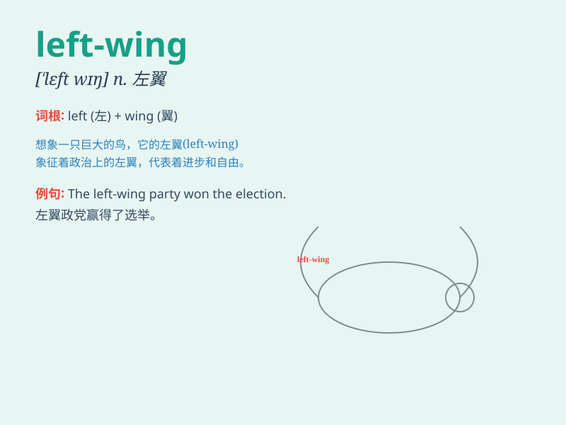

## left-wing

**英音:** _[left wɪŋ]_ **美音:** _[lɛft wɪŋ]_

**译义:** *adj.左翼的；左派的 n.左翼；左派*

### 短语

+ **left-wing ideology:** _左翼意识形态_

+ **left-wing politics:** _左翼政治_

+ **left-wing movement:** _左翼运动_

+ **left-wing party:** _左翼政党_

+ **left-wing view:** _左翼观点_

### 例句

#### 例句1

> **The politician is known for his left-wing views on social
justice.**

**中文翻译:** 这位政治家因其在社会正义方面的左翼观点而闻名。

**单词释义:** 左翼的

#### 例句2

> **The left-wing party has proposed a series of radical reforms.**

**中文翻译:** 左翼政党提出了一系列激进的改革。

**单词释义:** 左翼的

#### 例句3

> **She is an active supporter of left-wing causes.**

**中文翻译:** 她是左翼事业的积极支持者。

**单词释义:** 左翼的

### 背诵小故事

>
想象一下，在一个政治集会中，有一群人总是主张更多的社会福利和平等，他们站在左边的区域，被称为
left-wing 。他们就像左翼的飞鸟，追求公平和进步。

**想象在一个政治集会中，有一群总是主张更多社会福利和平等、站在左边区域被称为"左翼"的人。他们像左翼的飞鸟追求公平和进步。**

### 图义

