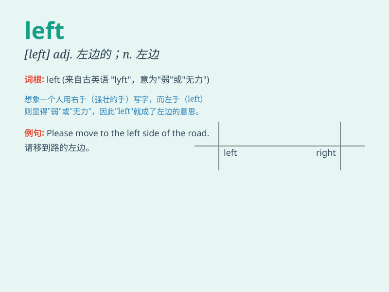

## left

**英音:** _[left]_ **美音:** _[lɛft]_

**译义:**
*adj.左边的,左倾的,左侧的,左派的,左翼的adv.在左面n.左,左边,左派
vbl.leave的过去式和过去分词*

### 短语

+ **on the left:** _在左边_

+ **left behind:** _留下；遗留；落后_

+ **turn left:** _向左转_

+ **left hand:** _左手_

+ **left wing:** _左翼；左派_

### 例句

#### 例句1

> **He left the room without a word.**

**中文翻译:** 他一言不发地离开了房间。

**单词释义:** 离开

#### 例句2

> **There are only two apples left.**

**中文翻译:** 只剩下两个苹果了。

**单词释义:** 剩下

#### 例句3

> **Turn left at the second crossing.**

**中文翻译:** 在第二个十字路口左转。

**单词释义:** 左边

### 背诵小故事

> One day, a little boy was lost. He stood at a crossroad and
remembered that his home was on the left side. So he followed that
direction and finally found his way back. The word \'left\' means the
direction opposite of right.

**有一天，一个小男孩迷路了。他站在十字路口，记得他家在左边。于是他朝着那个方向走，最终找到了回家的路。单词\'left\'意思是"右边"的相反方向。**

### 图义

