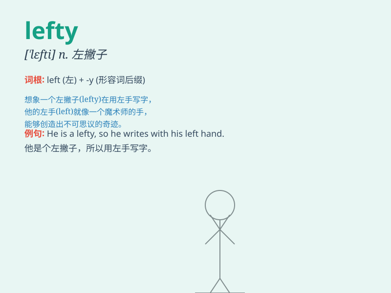

## lefty

**英音:** _[\'leftɪ]_ **美音:** _[\'lɛfti]_

**译义:** *n.左撇子,左翼分子*

### 短语

+ **lefty politician:** _左派政治家_

+ **lefty ideology:** _左派意识形态_

+ **lefty movement:** _左派运动_

+ **lefty view:** _左派观点_

+ **lefty group:** _左派团体_

### 例句

#### 例句1

> **The lefty pitcher has a unique throwing style.**

**中文翻译:** 左撇子投手具有独特的投掷风格。

**单词释义:** 左撇子

#### 例句2

> **He\'s known as a lefty in the political circle.**

**中文翻译:** 他在政界被称为左撇子。

**单词释义:** 左派

#### 例句3

> **The lefty guitarist played an amazing solo.**

**中文翻译:** 这位左撇子吉他手演奏了一段令人惊叹的独奏。

**单词释义:** 左撇子

### 背诵小故事

> There was a baseball game. A player named Tom was known as a
\'lefty\' because he always threw the ball with his left hand. This made
him stand out and gave his team an advantage.

**有一场棒球比赛。一个叫汤姆的球员被称为"左撇子"，因为他总是用左手投球。这使他脱颖而出，给球队带来了优势。**

### 图义

