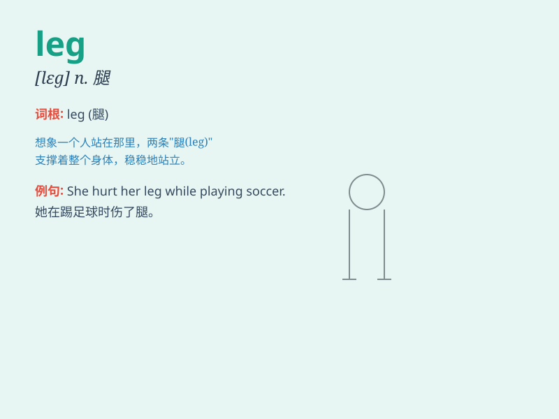

## leg

**英音:** _[leg]_ **美音:** _[lɛɡ]_

**译义:** *n.腿,胫,旅程的一段vi.走,跑*

### 短语

+ **break a leg:** _祝好运；大获成功（用于祝愿演员演出成功）_

+ **shake a leg:** _赶快；赶紧_

+ **stretch one\'s legs:** _（久坐后）散散步，活动活动腿脚_

+ **not have a leg to stand on:** _（论点等）站不住脚_

+ **cost an arm and a leg:** _价格昂贵；花费很大_

### 例句

#### 例句1

> **She broke her leg in a skiing accident.**

**中文翻译:** 她在一次滑雪事故中摔断了腿。

**单词释义:** 腿

#### 例句2

> **The table has four legs.**

**中文翻译:** 桌子有四个腿。

**单词释义:** 腿，支柱

#### 例句3

> **The last leg of the journey was the most difficult.**

**中文翻译:** 旅程的最后一段是最艰难的。

**单词释义:** 一段行程，一段路程

### 背诵小故事

> A thief was running away after stealing. A brave policeman chased
him. But the thief tripped and hurt his leg. The policeman caught him
easily.

**一个小偷偷完东西后正在逃跑。一位勇敢的警察在追他。但是小偷绊倒了，伤到了腿。警察轻松地抓住了他。**

### 图义

