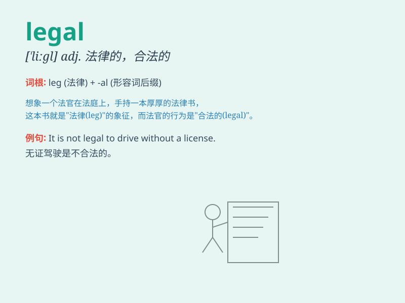

## legal

**英音:** _[\'liːg(ə)l]_ **美音:** _[\'ligl]_

**译义:** *adj.法律的,法定的,合法*

### 短语

+ **legal system:** _法律制度_

+ **legal action:** _法律诉讼_

+ **legal advice:** _法律咨询_

+ **legal document:** _法律文件_

+ **legal obligation:** _法律义务_

### 例句

#### 例句1

> **He decided to seek legal advice before signing the contract.**

**中文翻译:** 他决定在签订合同之前寻求法律建议。

**单词释义:** 法律的

#### 例句2

> **The company\'s actions were found to be legal.**

**中文翻译:** 经认定，该公司的行为合法。

**单词释义:** 合法的

#### 例句3

> **She has a legal obligation to support her children.**

**中文翻译:** 她有抚养孩子的法律义务。

**单词释义:** 法律上的

### 背诵小故事

> A thief was caught by the police. But his lawyer argued that the
evidence was not legal. Finally, justice prevailed and the thief was
punished. Remember, \'legal\' means conforming to the law.

**一个小偷被警察抓住了。但他的律师辩称证据不合法。最终，正义获胜，小偷受到了惩罚。记住，\'legal\'意思是合法的。**

### 图义

