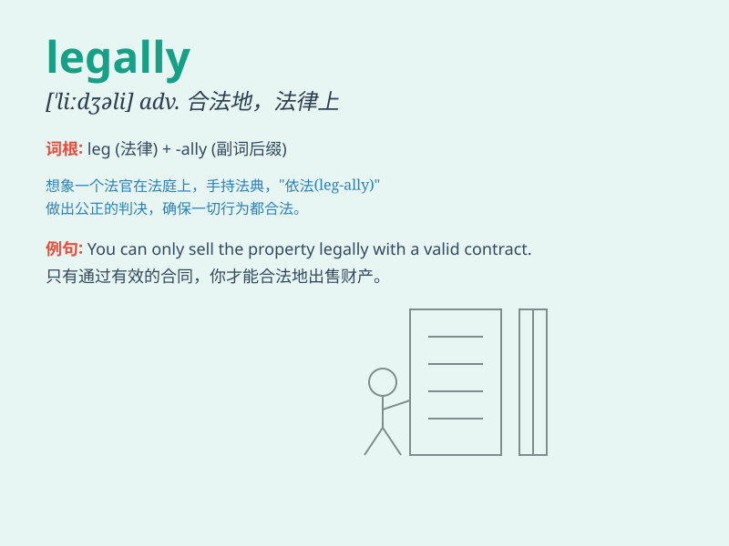

## legally

**英音:** _[ˈliːɡəli]_ **美音:** _[ˈliɡ(ə)li]_

**译义:** *adv.法律上,合法地*

### 短语

+ **legally binding:** _具有法律约束力的_

+ **legally responsible:** _负法律责任的_

+ **legally valid:** _合法有效的_

+ **legally enforceable:** _法律上可执行的_

+ **legally competent:** _有法定资格的_

### 例句

#### 例句1

> **The company operates legally and complies with all relevant laws
and regulations.**

**中文翻译:** 公司合法经营，遵守所有相关法律法规。

**单词释义:** 合法地

#### 例句2

> **He was legally entitled to claim compensation for the damage.**

**中文翻译:** 他依法有权要求损害赔偿。

**单词释义:** 依法；在法律上

#### 例句3

> **The contract was legally binding and both parties had to fulfill
their obligations.**

**中文翻译:** 该合同具有法律约束力，双方均须履行各自的义务。

**单词释义:** 合法有效的；在法律上有约束力的

### 背诵小故事

> A thief was caught but was released legally because of a lack of
evidence. The police were frustrated but had to follow the law. Legally
means in a way that is permitted by law.

**一个小偷被抓住了，但由于缺乏证据被依法释放了。警察很沮丧但不得不遵循法律。Legally
意思是以法律允许的方式。**

### 图义

