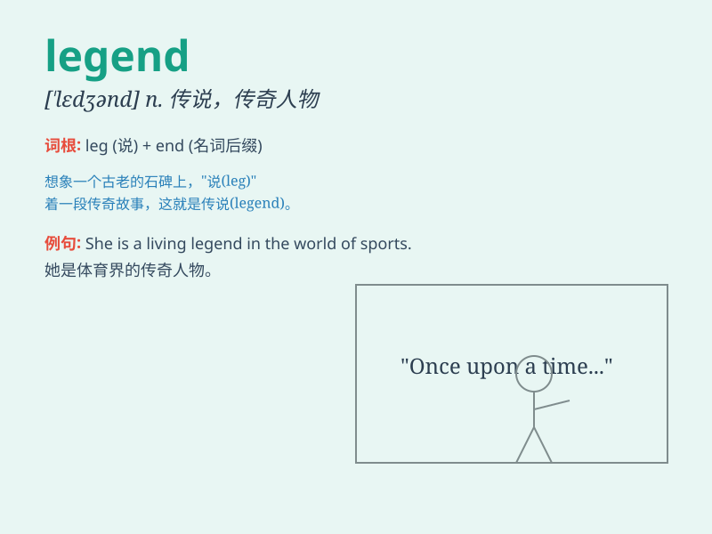

## legend

**英音:** _[\'ledʒ(ə)nd]_ **美音:** _[\'lɛdʒənd]_

**译义:** *n.传说,伟人传,图例
联想集团,中国最大的国有品牌微机制造商之一*

### 短语

+ **urban legend:** _都市传奇；城市传说_

+ **legend has it:** _据说；传说中_

+ **living legend:** _活着的传奇人物；当代传奇_

+ **football legend:** _足球传奇人物_

+ **music legend:** _音乐传奇人物_

### 例句

#### 例句1

> **The legend of King Arthur has captivated people for
centuries.**

**中文翻译:** 几个世纪以来，亚瑟王的传说一直吸引着人们。

**单词释义:** 传说；传奇故事

#### 例句2

> **He became a legend in the world of football.**

**中文翻译:** 他成为了足球界的传奇人物。

**单词释义:** 传奇人物

#### 例句3

> **The local legend says that this tree is haunted.**

**中文翻译:** 当地传说说这棵树闹鬼。

**单词释义:** 传说；传闻

### 背诵小故事

> In a mysterious ancient land, there was a story passed down through
generations. This story, full of heroic deeds and magical elements, was
known as a legend. People loved to tell and retell it around the
campfire.

**在一片神秘的古老土地上，有一个代代相传的故事。这个充满英雄事迹和神奇元素的故事被称为传奇。人们喜欢在篝火旁讲述和复述它。**

### 图义

