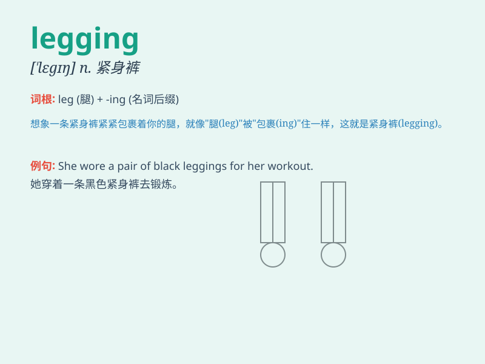

## legging

**英音:** _[\'legɪŋ]_ **美音:** _[\'legɪŋ]_

**译义:** *n.(通常用复数)绑腿、裹腿、护胫*

### 短语

+ **cotton legging:** _棉质打底裤_

+ **stretch legging:** _弹力打底裤_

+ **legging pants:** _打底裤裤装_

+ **faux leather legging:** _仿皮打底裤_

+ **printed legging:** _印花打底裤_

### 例句

#### 例句1

> **She wore black leggings and a white T-shirt.**

**中文翻译:** 她穿着黑色紧身裤和白色T恤。

**单词释义:** 打底裤

#### 例句2

> **The athlete put on her leggings before the race.**

**中文翻译:** 运动员在比赛前穿上紧身裤。

**单词释义:** 紧身裤

#### 例句3

> **I need to buy a new pair of leggings for yoga.**

**中文翻译:** 我需要买一条新的瑜伽紧身裤。

**单词释义:** 打底裤

### 背诵小故事

> One day, Lily was going for a run. But she forgot to wear her
leggings. So, she felt very cold. Then she quickly went back home to put
on the leggings and felt warm and comfortable. Legging means a
close-fitting stretchy garment for the legs.

**一天，莉莉准备去跑步。但她忘了穿她的紧身裤。所以，她觉得很冷。然后她迅速回家穿上紧身裤，感觉温暖又舒适。Legging
意思是紧身的有弹性的腿部衣物。**

### 图义

