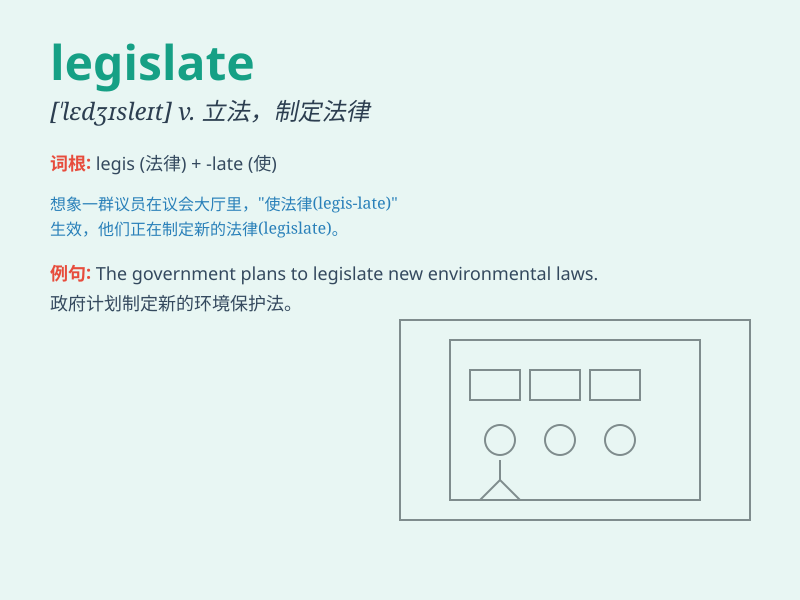

## legislate

**英音:** _[\'ledʒɪsleɪt]_ **美音:** _[\'lɛdʒɪslet]_

**译义:** *vi.制定法律vt.通过立法*

### 短语

+ **legislate against:** _立法禁止_

+ **legislate for:** _为\...立法_

+ **legislate on:** _就\...立法_

+ **legislate to do:** _立法去做_

+ **legislate into law:** _立法使之成为法律_

### 例句

#### 例句1

> **The government has the power to legislate on environmental
protection.**

**中文翻译:** 政府有环境保护立法权。

**单词释义:** 立法；制定法律

#### 例句2

> **It is the responsibility of the parliament to legislate for the
public good.**

**中文翻译:** 议会有责任为公共利益立法。

**单词释义:** 立法；制定法律

#### 例句3

> **We need to legislate to prevent such crimes from happening
again.**

**中文翻译:** 我们需要立法，防止此类犯罪再次发生。

**单词释义:** 立法；制定法律

### 背诵小故事

> A king needed to legislate new laws to make his kingdom peaceful. He
sat on his throne, thinking hard. Finally, he made wise decisions that
made everyone happy. Remember, \'legislate\' means to make laws!

**一位国王需要制定新的法律以使他的王国和平。他坐在王座上，努力思考。最后，他做出了明智的决定，让每个人都很开心。记住，\'legislate\'
意思是立法！**

### 图义

