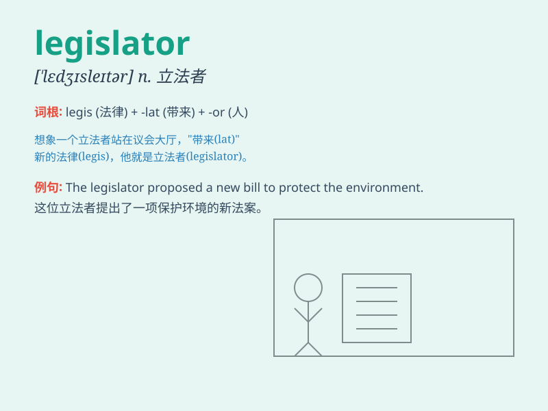

## legislator

**英音:** _[\'ledʒɪsleɪtə]_ **美音:** _[\'lɛdʒɪsletɚ]_

**译义:** *n.立法者*

### 短语

+ **experienced legislator:** _经验丰富的立法者_

+ **local legislator:** _地方立法者_

+ **federal legislator:** _联邦立法者_

+ **elected legislator:** _当选的立法者_

+ **influential legislator:** _有影响力的立法者_

### 例句

#### 例句1

> **The legislator proposed a new law to protect the environment.**

**中文翻译:** 立法者提出了一项保护环境的新法律。

**单词释义:** 立法者

#### 例句2

> **The actions of the legislator were widely criticized by the
public.**

**中文翻译:** 立法会议员的行为遭到公众广泛批评。

**单词释义:** 立法者

#### 例句3

> **The experienced legislator has made significant contributions to
the legal system.**

**中文翻译:** 这位经验丰富的立法者为法律体系做出了重大贡献。

**单词释义:** 立法者

### 背诵小故事

> A legislator was like a superhero in a suit. He/she had the power to
create and change laws to make the city a better place. One day, the
legislator passed a law to protect the environment. People were happy
and grateful.

**一位立法者就像穿着西装的超级英雄。他/她有权制定和更改法律，以使城市变得更美好。有一天，这位立法者通过了一项保护环境的法律。人们既高兴又感激。**

### 图义

