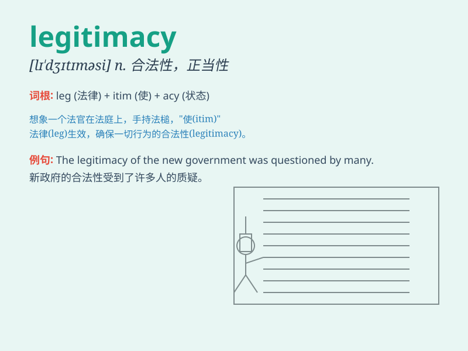

## legitimacy

**英音:** _[lɪ\'dʒɪtɪməsɪ]_ **美音:** _[lɪ\'dʒɪtəməsi]_

**译义:** *n.合法(性),正统(性),正确(性),合理(性)*

### 短语

+ **political legitimacy:** _政治合法性_

+ **question the legitimacy:** _质疑合法性_

+ **legitimacy of power:** _权力的合法性_

+ **establish legitimacy:** _确立合法性_

+ **lack of legitimacy:** _缺乏合法性_

### 例句

#### 例句1

> **The legitimacy of the new government was questioned by many
people.**

**中文翻译:** 新政府的合法性受到了许多人的质疑。

**单词释义:** 合法性

#### 例句2

> **The company\'s actions were called into question regarding their
legitimacy.**

**中文翻译:** 该公司的行为在其合法性方面受到了质疑。

**单词释义:** 合法性

#### 例句3

> **We need to establish the legitimacy of this decision.**

**中文翻译:** 我们需要确立这个决定的合法性。

**单词释义:** 合法性

### 背诵小故事

> A king\'s rule was questioned. But he proved his legitimacy by
following fair laws and caring for his people. His actions showed that
his power was rightful and accepted. Legitimacy means being lawful and
accepted.

**一位国王的统治受到了质疑。但他通过遵循公平的法律和关爱他的人民证明了他的合法性。他的行为表明他的权力是合法且被认可的。legitimacy
意思是合法（性）；正统（性）；合理性**

### 图义

