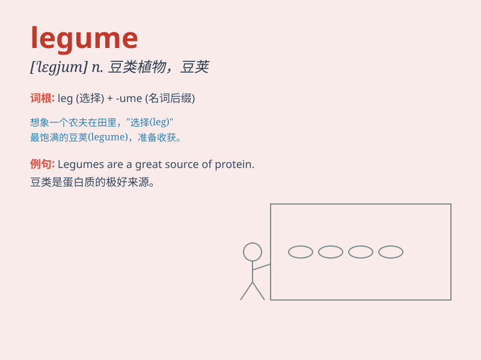

## legume

**英音:** _[\'legjuːm]_ **美音:** _[\'lɛgjʊm]_

**译义:** *n.豆类,豆荚*

### 短语

+ **legume crop:** _豆类作物_

+ **edible legume:** _可食用的豆类_

+ **legume family:** _豆科_

+ **nitrogen-fixing legume:** _固氮豆类_

+ **dry legume:** _干豆类_

### 例句

#### 例句1

> **Peas and beans are common legumes.**

**中文翻译:** 豌豆和豆类是常见的豆类作物。

**单词释义:** 豆类作物

#### 例句2

> **The legume harvest was bountiful this year.**

**中文翻译:** 今年豆类作物的收成很丰富。

**单词释义:** 豆类作物

#### 例句3

> **She planted various legumes in her garden.**

**中文翻译:** 她在她的花园里种了各种各样的豆类。

**单词释义:** 豆类

### 背诵小故事

> A hungry rabbit was looking for food in the garden. It found many
legumes, like peas and beans. The rabbit was so happy as it could have a
big meal. Now you know legume means plants like peas and beans.

**一只饥饿的兔子在花园里找食物。它发现了很多豆类，比如豌豆和豆子。兔子非常高兴，因为它可以饱餐一顿。现在你知道
legume 指的是像豌豆和豆子这样的植物。**

### 图义

