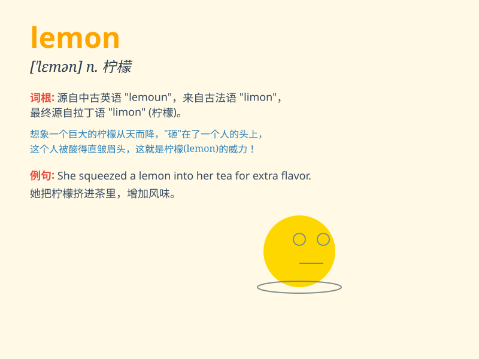

## lemon

**英音:** _[\'lemən]_ **美音:** _[\'lɛmən]_

**译义:** *n.柠檬adj.柠檬色的*

### 短语

+ **lemon juice:** _柠檬汁_

+ **lemon tree:** _柠檬树_

+ **lemon peel:** _柠檬皮_

+ **lemon slice:** _柠檬片_

+ **lemon flavor:** _柠檬味_

### 例句

#### 例句1

> **I bought a lemon from the market.**

**中文翻译:** 我从市场买了一个柠檬。

**单词释义:** 柠檬

#### 例句2

> **This car is a lemon. It always breaks down.**

**中文翻译:** 这辆车是个次品。它老是出故障。

**单词释义:** 次品；蹩脚货

#### 例句3

> **The lemon juice is very sour.**

**中文翻译:** 柠檬汁很酸。

**单词释义:** 柠檬

### 背诵小故事

> One day, I was very thirsty. I opened the fridge and found a lemon. I
cut it and squeezed the juice into a glass of water. The sour taste made
me feel refreshed.

**有一天，我非常口渴。我打开冰箱发现了一个柠檬。我把它切开，把柠檬汁挤进一杯水里。酸酸的味道让我感到神清气爽。**

### 图义

