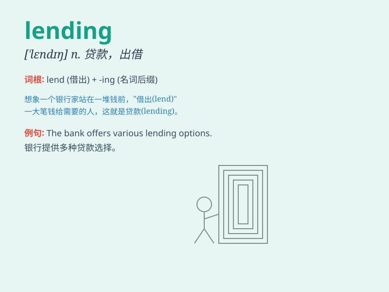

## lending

**英音:** _[ˈlendɪŋ]_ **美音:** _[ˈlendɪŋ]_

**译义:** *n.出借,出租,贷款,出借物,出租物*

### 短语

+ **lending library:** _出借图书馆；租书图书馆_

+ **lending rate:** _贷款利率_

+ **lending institution:** _贷款机构；借贷机构_

+ **peer-to-peer lending:** _个人对个人借贷；P2P 借贷_

+ **lending limit:** _贷款限额；放款限额_

### 例句

#### 例句1

> **The bank\'s lending policies have become more strict
recently.**

**中文翻译:** 这家银行的贷款政策最近变得更加严格了。

**单词释义:** 贷款

#### 例句2

> **The lending library has a wide range of books.**

**中文翻译:** 这个出借图书馆有各种各样的书。

**单词释义:** 出借

#### 例句3

> **His lending of the money helped us a lot.**

**中文翻译:** 他借出钱帮助了我们很多。

**单词释义:** 借出

### 背诵小故事

> A poor student needed money for books. A kind teacher came to his aid
by lending him the necessary funds. The student was grateful and
promised to return it soon. Lending means giving something, usually
money, to someone for a period of time.

**一个贫困的学生需要钱买书。一位善良的老师通过借给他必要的资金来帮助他。学生很感激，并承诺很快归还。lending
意思是把某物，通常是钱，借给某人一段时间。**

### 图义

