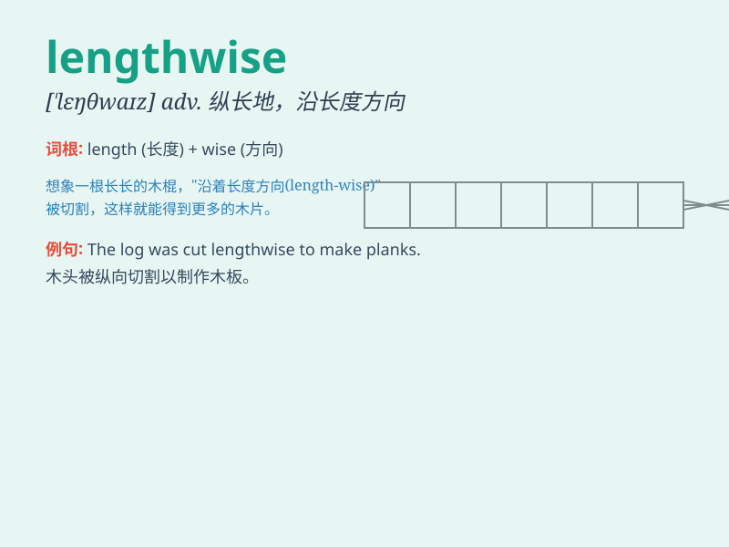

## lengthwise

**英音:** _[\'leŋθwaɪz; -ŋkθ-]_ **美音:**
_[\'lɛŋθ,waɪz]_

**译义:** *adj.\<美>=lengthways*

### 短语

+ **lengthwise direction:** _纵向_

+ **lengthwise cut:** _纵向切割_

+ **lengthwise measurement:** _纵向测量_

+ **lengthwise arrangement:** _纵向排列_

+ **lengthwise section:** _纵向剖面_

### 例句

#### 例句1

> **The board should be cut lengthwise.**

**中文翻译:** 这块木板应该纵向切割。

**单词释义:** 纵向地

#### 例句2

> **The fabric was folded lengthwise.**

**中文翻译:** 这块布料被纵向折叠了。

**单词释义:** 纵向地

#### 例句3

> **The book is too long to fit on the shelf lengthwise.**

**中文翻译:** 这本书太长了，纵向放不进书架。

**单词释义:** 纵向地

### 背诵小故事

> A little ant was trying to measure a long stick. It moved lengthwise
along the stick but got confused. Then a wise bird told it to measure
from one end to the other, that\'s what \'lengthwise\' means - in the
direction of the length.

**一只小蚂蚁试图测量一根长棍。它沿着棍子纵向移动，但感到困惑。然后一只聪明的鸟告诉它从一端量到另一端，这就是\'lengthwise\'的意思------纵向的方向。**

### 图义

