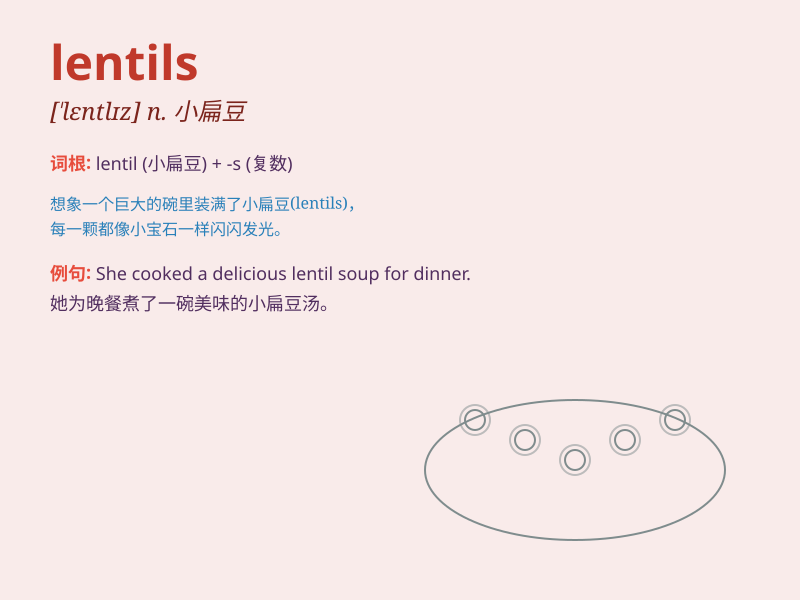

## lentils

**英音:** _[ˈlentɪlz]_ **美音:** _[ˈlentɪlz]_

**译义:** *n.小扁豆（lentil 的复数）*

### 短语

+ **red lentils:** _红扁豆_

+ **lentils soup:** _扁豆汤_

+ **cooked lentils:** _煮熟的扁豆_

+ **green lentils:** _绿扁豆_

+ **lentils salad:** _扁豆沙拉_

### 例句

#### 例句1

> **I cooked some lentils for dinner.**

**中文翻译:** 我煮了一些小扁豆当晚餐。

**单词释义:** 小扁豆（复数形式）

#### 例句2

> **The lentils are rich in protein.**

**中文翻译:** 这些小扁豆富含蛋白质。

**单词释义:** 小扁豆（复数形式）

#### 例句3

> **She added lentils to the soup to make it more nutritious.**

**中文翻译:** 她往汤里加了小扁豆，让汤更有营养。

**单词释义:** 小扁豆（复数形式）

### 背诵小故事

> A poor farmer had only a few lentils left. But he was creative. He
planted them and with care, they grew into a big harvest. The lentils
saved his family from hunger.

**一个贫穷的农民只剩下几颗小扁豆。但他很有创造力。他把它们种下，悉心照料，它们长成了大丰收。小扁豆让他的家人免于饥饿。**

### 图义

