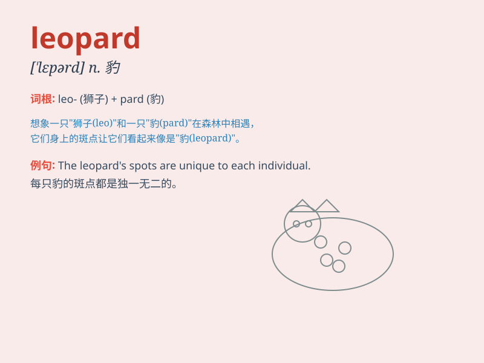

## leopard

**英音:** _[\'lepəd]_ **美音:** _[\'lɛpɚd]_

**译义:** *n.豹,美洲豹.美洲虎*

### 短语

+ **leopard print:** _豹纹_

+ **leopard skin:** _豹皮_

+ **snow leopard:** _雪豹_

+ **clouded leopard:** _云豹_

+ **leopard cat:** _豹猫_

### 例句

#### 例句1

> **The leopard is a powerful and agile predator.**

**中文翻译:** 豹子是一种强大且敏捷的捕食者。

**单词释义:** 豹子

#### 例句2

> **She wore a dress with a leopard print.**

**中文翻译:** 她穿了一条带有豹纹的裙子。

**单词释义:** 豹纹

#### 例句3

> **The leopard stalked its prey through the jungle.**

**中文翻译:** 这头豹子在丛林中悄悄跟踪它的猎物。

**单词释义:** 豹子

### 背诵小故事

> A little monkey was playing in the forest. Suddenly, a leopard jumped
out. The monkey was so scared. But the leopard just passed by quickly.
The monkey realized that the leopard was chasing its prey.

**一只小猴子在森林里玩耍。突然，一只豹子跳了出来。猴子非常害怕。但豹子很快就过去了。猴子意识到豹子在追逐它的猎物。**

### 图义

