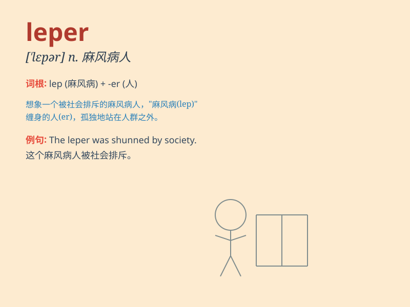

## leper

**英音:** _[\'lepə]_ **美音:** _[\'lɛpɚ]_

**译义:** *n.麻疯病患者,受蔑视的人*

### 短语

+ **leper colony:** _麻风病患者聚居区_

+ **leper hospital:** _麻风病医院_

+ **social leper:** _被社会遗弃的人_

+ **outcast leper:** _被排斥的麻风病患者_

+ **leper priest:** _照顾麻风 病人的牧师_

### 例句

#### 例句1

> **The leper was isolated from the community for fear of
contagion.**

**中文翻译:** 由于担心传染，那个麻风病人被与社区隔离开了。

**单词释义:** 麻风病人

#### 例句2

> **In the old days, lepers were often shunned and treated with great
cruelty.**

**中文翻译:** 在过去，麻风病人经常被回避并且受到极大的残忍对待。

**单词释义:** 麻风病人

#### 例句3

> **The story tells of a kind-hearted doctor who cared for
lepers.**

**中文翻译:** 这个故事讲述了一位善良的医生照顾麻风病人的事情。

**单词释义:** 麻风病人

### 背诵小故事

> In a small village, there was a mysterious figure named Tom. Everyone
avoided him because he was a leper. One day, a kind doctor came and
treated him, showing that love can overcome fear. Remember, a leper is a
person with leprosy.

**在一个小村庄里，有一个叫汤姆的神秘人物。大家都躲着他，因为他是个麻风病人。有一天，一位善良的医生来了并为他治疗，这表明爱可以战胜恐惧。记住，leper
是麻风病人的意思。**

### 图义

